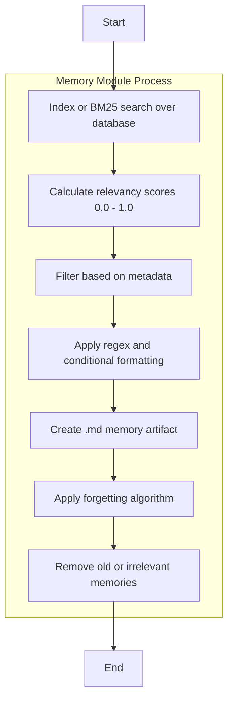

# Memory Module for adding Context to Agents
---

This project aims to create a drop in memory module solution for scalable agent frameworks. Using lightweight search and database technologies to construct an augemented `system_prompt` and additional `context augemented inference prompt` to ensure agents stay grounded to their context and concerns.

# Context and Memory 

LLMs are goldfish. You have to provide their full context within the prompt, this includes the request, AND the potential answer formatted to align to the users need. Temporality remains a blank single state for the goldfish, meaning if you want an account of time passing and changing contexts you'll need to compress this duration into a single step ( a conversation history of previous Question and Answer pairs provided under a instruction like "Here is your ongoing conversation with the user... q: text \n a: text \n q: text \n a: text \n..." ). Conversation histories become sliding windows of the conversation, grounded context get piped in with a relevenace metric derived from your search algorithm, your have to re-center your query so the request isn't lost in the style of your ingested knowledge... 

Typical Example of a Memory Schema:

```md
# Memory Module for Agent Context

## Conversation History
```
q: [User's most recent question]
a: [Agent's most recent answer]
q: [User's current question]
```

## Relevant Context
1. [Most relevant piece of context]
2. [Second most relevant piece of context]
3. [Third most relevant piece of context]

## Short-term Memory
- [Recent key information 1]
- [Recent key information 2]
- [Recent key information 3]

## Long-term Memory
- [Persistent fact 1]
- [Persistent fact 2]
- [Persistent fact 3]

## External References
1. [Title 1](URL1)
2. [Title 2](URL2)

## Context Metadata
- Last Updated: [Timestamp]
- Relevance Score: [Score]

## Current Query
- [User's current question]

## Styled Answer Request
- [Agent's current answer]

```

---

# Proposed Abstracted Architecture for a Contextual Memory Module

These memories should serve as objects for the llm to reason on, so the formatting, chunking and metadata should only relate to ensuring the quality of knowledge ingestion.

- Short term memory for recalling the most recent key information
- Long term memory for recalling persistent facts
- External references for recalling specific grounded information
- Context metadata for filtering and scoring the relevance of the information
- Temporial/relevency frequency pruning of decaying memories

Because we are looking to potential scale from 5 agents to 100,000 we need to look at a basic system level approach to memory. Relying on "off the shelf" embeddings has the potential to expodentially add to compute and cost. A conservative token count and terse prompts will be key as well as using appropriately lightweight retrieval methods. 

## Short-term Memory

A sliding window of last n rounds.

## Long-term Memory

Recalled items from a db.

---

Initial Proposed Toolset:

- python, tiktoken, a basic handrolled or easy library for db
- Index or BM25 search over the database
- 0.0 - 1.0 scores for relevancy
- Filtering based on metadata
- regex and conditional formatting to create a .md memory artifact
- Forgetting algorithm to remove old or irrelevant memories

---



TASKS:

- Implement a simple command line tool that searches a relevent database and injests json formated chatlogs into a single memory object.
- Simplify this artifact down to a single md file with a header and a bulleted list of key information.
- Detail forgetting algorithm for removing old or irrelevant memories.
- Create a basic system prompt for the agent to use the memory in a conversation.
- Create a basic prompt for the agent to use the memory in a conversation.

## External References

Related papers and links to thoughts on working memory in humans and llms:


