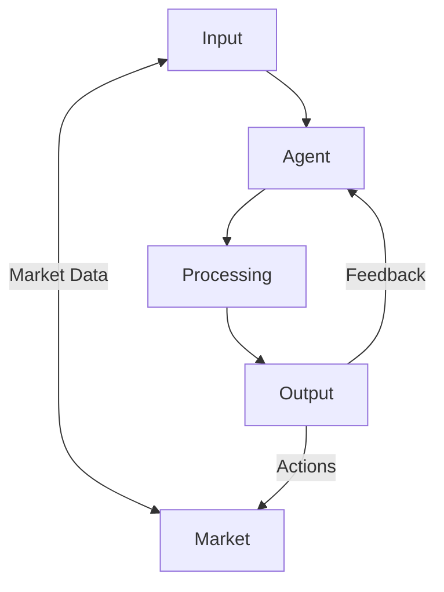
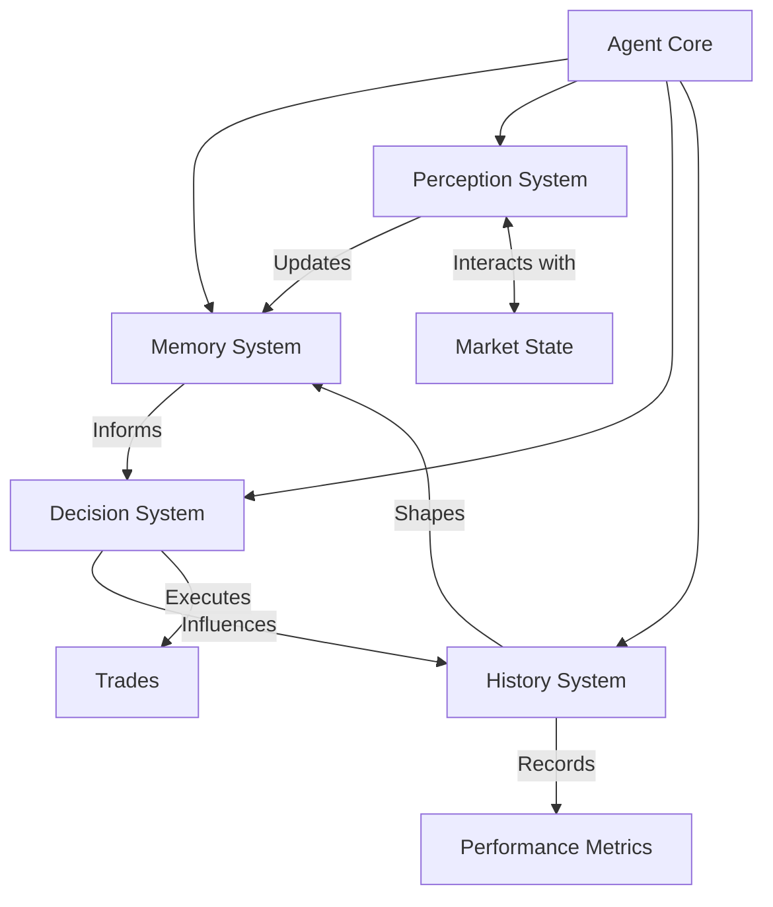

Agent Market Memory at Three Levels of Abstraction

```mermaid
graph TD
    A[Agent]
    
    I[Input]
    P[Processing]
    O[Output]
    
    I --> A
    A --> P
    P --> O
    O --> |Feedback| A
    
    I <--> |Market Data| M[Market]
    O --> |Actions| M
```

```mermaid
graph TD
    A[Agent Core]
    
    M[Memory System]
    P[Perception System]
    D[Decision System]
    H[History System]
    
    A --> M
    A --> P
    A --> D
    A --> H
    
    M --> |Informs| D
    P --> |Updates| M
    D --> |Influences| H
    H --> |Shapes| M
    
    P <--> |Interacts with| MS[Market State]
    D --> |Executes| T[Trades]
    H --> |Records| PM[Performance Metrics]
```

```mermaid
graph TD
    Z[ZIAgent Memory]
    
    STM[Short-term Memory]
    LTM[Long-term Memory]
    WM[Working Memory]
    AM[Associative Memory]
    EM[Episodic Memory]
    
    Z --> STM
    Z --> LTM
    Z --> WM
    Z --> AM
    Z --> EM
    
    STM --> |Holds| RT[Recent Trades]
    STM --> |Monitors| CMS[Current Market State]
    STM --> |Sets| IG[Immediate Goals]
    
    LTM --> |Stores| TS[Trading Strategy]
    LTM --> |Records| HP[Historical Performance]
    LTM --> |Recognizes| LP[Learned Patterns]
    
    WM --> |Executes| CDP[Current Decision Process]
    WM --> |Performs| AC[Active Calculations]
    
    AM --> |Links| MCS[Market Conditions to Strategies]
    AM --> |Identifies| PPM[Price Pattern Movements]
    
    EM --> |Remembers| MT[Memorable Trades]
    EM --> |Marks| TM[Trading Milestones]
    
    PTH[Personal Trade History]
    CS[Current State]
    BAH[Bid/Ask History]
    PM[Performance Metrics]
    MP[Market Perception]
    
    Z --> PTH
    Z --> CS
    Z --> BAH
    Z --> PM
    Z --> MP
    
    PTH --> |Logs| PT[Past Trades]
    PTH --> |Calculates| CPL[Cumulative Profit/Loss]
    
    CS --> |Tracks| CA[Current Allocation]
    CS --> |Maintains| CPS[Current Preference Schedule]
    
    BAH --> |Records| PBA[Past Bids/Asks]
    BAH --> |Computes| SR[Success Rate]
    
    PM --> |Measures| PSE[Personal Surplus Extracted]
    PM --> |Evaluates| RE[Relative Efficiency]
    
    MP --> |Estimates| PMP[Perceived Market Price]
    MP --> |Assesses| PSDB[Perceived Supply/Demand Balance]
    
    STM <--> |Informs| WM
    LTM <--> |Guides| WM
    AM <--> |Supports| WM
    EM <--> |Contextualizes| AM
    
    STM <--> |Updates| CS
    LTM <--> |Shapes| PTH
    WM <--> |Uses| BAH
    AM <--> |Enhances| MP
    EM <--> |Contributes to| PM
```
