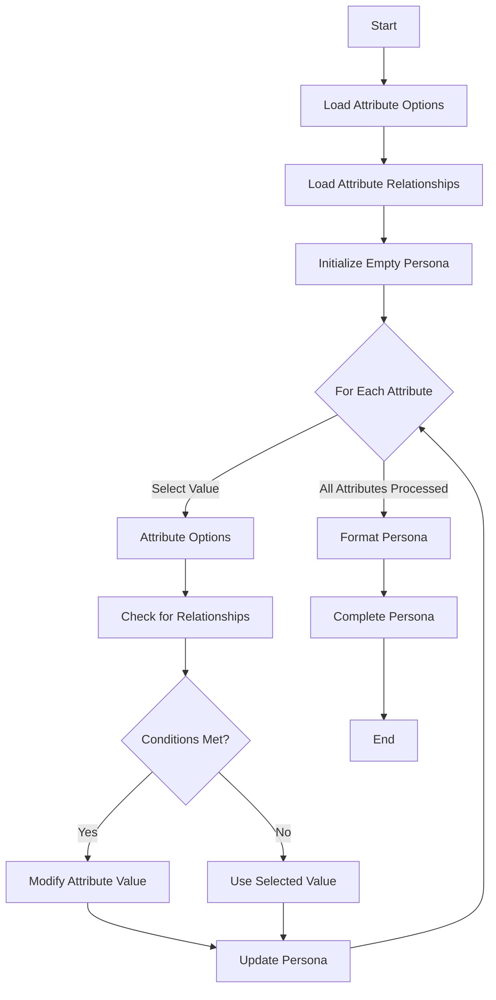
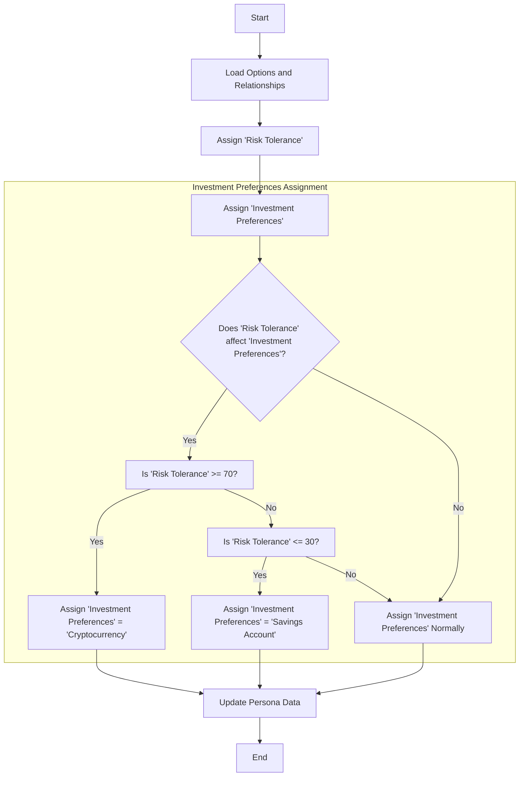

The project aims to generate realistic personas for market simulation, taking into account various attributes and their relationships. The main components are:

1. Attribute Options: Defines possible values for each attribute
2. Attribute Relationships: Defines how attributes influence each other
3. Persona Generator: Creates personas based on the options and relationships
4. Main Script: Orchestrates the generation process and saves the results





Now, let's examine each step in more detail:

1. Input:
   - YAML configuration files: attribute_options.yaml, attribute_relationships.yaml, persona_template.yaml
   - Number of personas to generate

Processing:
   - Load configuration files
   - Initialize AttributeOptions, AttributeRelationships, and PersonaGenerator classes

Output:
   - Initialized objects ready for persona generation

Expected outcome: The system is prepared with all necessary data and objects to start generating personas.

2. Input:
   - Initialized objects from step 1

Processing:
   - Generate a persona:
     a. Iterate through attributes
     b. Generate each attribute value
     c. Apply relationship weights and adjust values accordingly
   - Format persona data using the template

Output:
   - A Persona object with generated attributes

Expected outcome: A realistic persona with attributes that are influenced by each other, reflecting real-world relationships between characteristics.

3. Input:
   - Generated Persona object

Processing:
   - Convert Persona object to YAML format
   - Save YAML to a file in the output directory

Output:
   - YAML file containing the generated persona

Expected outcome: A well-structured, human-readable file containing the persona data, ready for use in market simulations or other applications.

4. Input:
   - Number of personas to generate

Processing:
   - Repeat steps 2-3 for the specified number of personas

Output:
   - Multiple YAML files, each containing a unique persona

Expected outcome: A collection of diverse, realistic personas that can be used for market simulations or other purposes requiring varied user profiles.

The current weights and relationships affect the generation of personas in several ways:

1. Age-based relationships:
   - Younger personas are more likely to have lower education levels and less investment experience.
   - Older personas (65+) have a high probability of being retired.
   - Middle-aged personas are more likely to have higher income brackets and more investment experience.

2. Education and occupation relationships:
   - Higher education levels are associated with higher-income occupations and income brackets.
   - Certain occupations are more likely in specific geographic locations.

3. Income-based relationships:
   - Higher income brackets are associated with more liberal spending habits, higher saving preferences, and more investment experience.
   - Income influences risk tolerance and investment preferences.

4. Personality trait influences:
   - Openness is positively correlated with risk tolerance and diverse hobbies.
   - Conscientiousness is positively correlated with saving preferences and negatively with spending habits.
   - Extraversion is positively correlated with spending habits and certain occupations.
   - Neuroticism is negatively correlated with risk tolerance.

5. Risk profile relationships:
   - Risk tolerance and risk appetite are strongly correlated.
   - Higher risk tolerance is associated with more aggressive investment preferences.

6. Life stage and events:
   - Relationship status influences spending habits, saving preferences, and goals.
   - Recent life events affect mood, short-term goals, and long-term goals.

These relationships ensure that the generated personas have realistic and coherent attribute combinations, avoiding unlikely or contradictory characteristics. The weighted system allows for some variability while maintaining overall plausibility, resulting in a diverse but believable set of personas for market simulations or other applications requiring varied user profiles.

```mermaid
graph TD
    Age --> |influences| Education
    Age --> |influences| Occupation
    Age --> |influences| IncomeBracket
    Age --> |influences| InvestmentExperience
    Age --> |influences| RiskAppetite

    Education --> |influences| Occupation
    Education --> |influences| IncomeBracket
    Education --> |influences| InvestmentExperience

    Occupation --> |influences| IncomeBracket
    Occupation --> |influences| GeographicLocation

    IncomeBracket --> |influences| SpendingHabits
    IncomeBracket --> |influences| SavingPreferences
    IncomeBracket --> |influences| RiskTolerance
    IncomeBracket --> |influences| InvestmentPreferences

    Openness --> |influences| RiskTolerance
    Openness --> |influences| HobbiesInterests

    Conscientiousness --> |influences| SavingPreferences
    Conscientiousness --> |influences| SpendingHabits

    Extraversion --> |influences| SpendingHabits
    Extraversion --> |influences| Occupation

    Neuroticism --> |negative influence| RiskTolerance

    RiskTolerance <--> |strong correlation| RiskAppetite
    RiskTolerance --> |influences| InvestmentPreferences

    RelationshipStatus --> |influences| SpendingHabits
    RelationshipStatus --> |influences| SavingPreferences
    RelationshipStatus --> |influences| LongTermGoals

    LifeEvents --> |influences| Mood
    LifeEvents --> |influences| ShortTermGoals
    LifeEvents --> |influences| LongTermGoals

    DecisionMakingStyle --> |influences| RiskAppetite
    DecisionMakingStyle --> |influences| InvestmentPreferences
    DecisionMakingStyle --> |influences| SpendingHabits
    ```