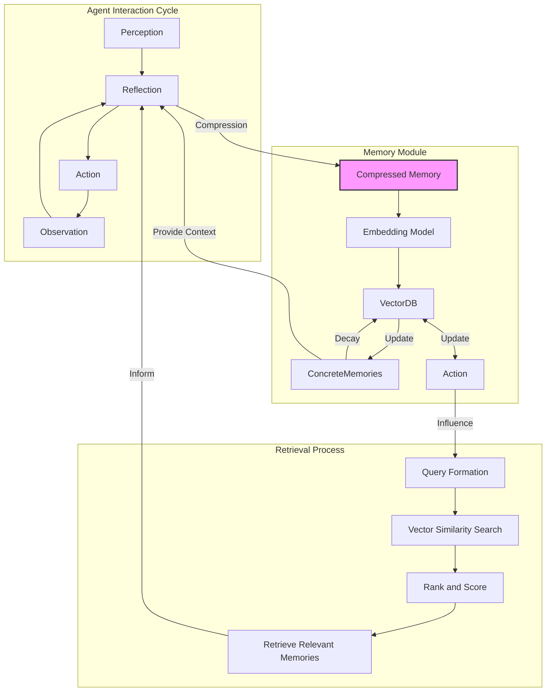

# memoryMODULE Design Specification

## Overview

This document outlines the design for a Memory Unit system, which forms the basis for both short-term and long-term memory in our AI agent architecture. The system is built using Pydantic models for strong typing and data validation, and incorporates computed fields for relevance, recency, and importance.

## Base MemoryUnit

The `MemoryUnit` serves as the base class for all memory types.

```python
from pydantic import BaseModel, Field
from datetime import datetime
from typing import Dict, Any, List

class MemoryUnit(BaseModel):
    content: str
    timestamp: datetime = Field(default_factory=datetime.now)
    forgetting_factor: float = 1.0
    metadata: Dict[str, Any] = Field(default_factory=dict)
    
    vector_db: Any
    embedding_model: Any
    retrieval_method: Any
    chunking_strategy: Any

    class Config:
        arbitrary_types_allowed = True

    @property
    def relevance(self) -> float:
        # Implementation details
        pass

    @property
    def recency(self) -> float:
        # Implementation details
        pass

    @property
    def importance(self) -> float:
        # Implementation details
        pass

    @property
    def score(self) -> float:
        alpha_recency = 0.3
        alpha_importance = 0.3
        alpha_relevance = 0.4
        return (alpha_recency * self.recency) + (alpha_importance * self.importance) + (alpha_relevance * self.relevance)

    def chunk(self, input_data: str) -> List[str]:
        # Implementation details
        pass

    def index(self, chunks: List[str]) -> Any:
        # Implementation details
        pass

    def forget(self, threshold: float) -> bool:
        # Implementation details
        pass

    def retrieve(self, query: str) -> List[Dict[str, Any]]:
        # Implementation details
        pass

    def decay(self, rate: float = 0.99):
        # Implementation details
        pass

    def reinforce(self, factor: float = 1.1):
        # Implementation details
        pass
```

## ShortTermMemory

The `ShortTermMemory` class extends `MemoryUnit` for recent interactions or ongoing tasks.

```python
class ShortTermMemory(MemoryUnit):
    lifespan: int = Field(default=5, description="Number of interaction cycles this memory persists")

    def update_lifespan(self):
        # Decrease lifespan with each interaction
        pass
```

## LongTermMemory

The `LongTermMemory` class extends `MemoryUnit` for persistent, important information.

```python
class LongTermMemory(MemoryUnit):
    consolidation_count: int = Field(default=0, description="Number of times this memory has been reinforced")

    def consolidate(self):
        # Increase consolidation count and adjust importance
        pass
```

## Key Components

1. **Vector Database (SimpleVectorDB)**: Stores and manages vector representations of memories.
2. **Embedding Model**: Converts text to vector representations.
3. **Chunking Strategy**: Breaks down long text inputs into manageable chunks.
4. **Memory Manager**: Orchestrates the creation, retrieval, and management of memories.

## Memory Lifecycle

1. **Creation**: Memories are created from agent perceptions, actions, observations, and reflections.
2. **Indexing**: Memories are chunked, embedded, and stored in the vector database.
3. **Retrieval**: Memories are retrieved based on relevance to current context, recency, and importance.
4. **Decay**: Memories gradually lose importance over time unless reinforced.
5. **Forgetting**: Memories below a certain threshold are removed or archived.
6. **Reinforcement**: Important or frequently accessed memories are strengthened.

## Key Processes

1. **Reflection -> Memory Retrieval**: The agent's internal monologue is used as a query for memory retrieval.
2. **Memory Ingestion**: Retrieved memories are used in the action generation process.
3. **Reflection**: Agent reflects on its perception, action, and observation, creating a compressed memory.
4. **Memory Update**: The reflection is stored as a new memory or updates existing memories.



## Implementation Notes

- The `cosine_check_and_update` method in `SimpleVectorDB` ensures that similar memories are updated rather than duplicated.
- The `decay_memories` method in `MemoryManager` applies decay to all memories periodically.
- The `forget_memories` method removes memories below a certain importance threshold.

## Work In Progress

- Refactoring 
- Implement greater frameworks db replacing my placeholder pickled-index 🥒
- Handle the embedding model call with other api calls
- Implement a more careful and type sensitive chunking strat, that was a `cursor` generation align with projects tokenizer
- Write tests, punish it with a few generations then work on regex methods for edges after reading logs
