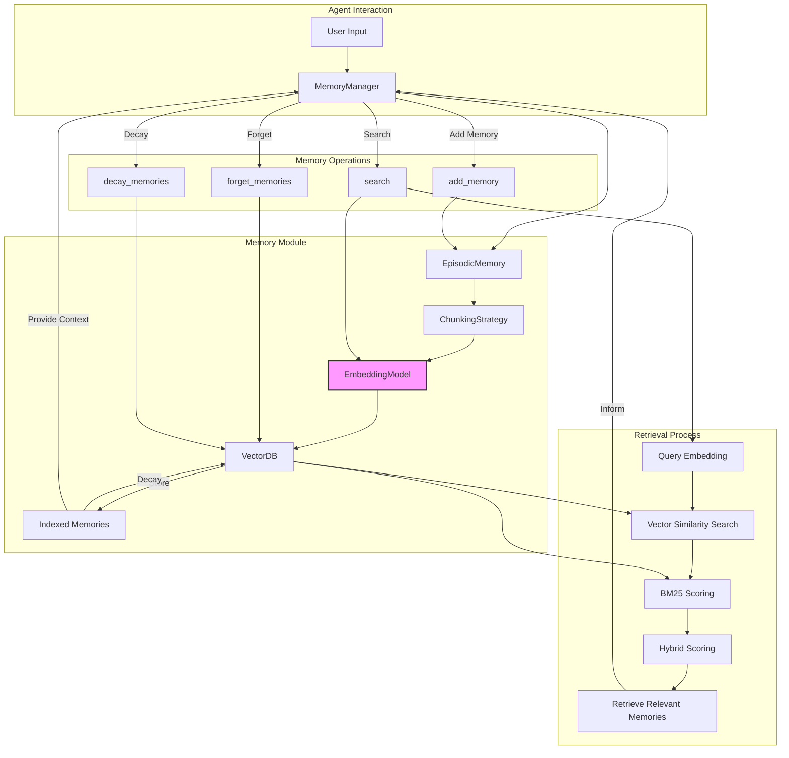

# memoryMODULE Design Specification

## Overview

This document outlines the design for an AI Memory Management System, which simulates human-like memory processes including storage, retrieval, decay, and forgetting. The system uses vector embeddings for semantic similarity, TF-IDF for relevance scoring, and implements a forgetting factor for memory decay.

## Key Components

1. **EmbeddingModel**: Handles text-to-vector conversion using OpenAI's API.
2. **VectorDB**: Manages vector storage and retrieval, including cosine similarity search and BM25 scoring.
3. **ChunkingStrategy**: Breaks text into manageable chunks.
4. **EpisodicMemory**: Represents individual memories.
5. **MemoryManager**: Orchestrates all memory operations.

## EmbeddingModel

```python
class EmbeddingModel:
    def __init__(self, model="nomic-embed-text:latest"):
        self.client = OpenAI(base_url='http://localhost:11434/v1/', api_key='ollama')
        self.model = model

    def embed(self, text):
        # Implementation details
        pass
```

## VectorDB

```python
class VectorDB:
    def __init__(self, vector_dim: int = 768):
        # Initialization details

    def add_item(self, vector: List[float], meta: Dict[str, Any]):
        # Implementation details

    def calculate_bm25_scores(self, query_terms: List[str], k1: float = 1.5, b: float = 0.75) -> Dict[int, float]:
        # Implementation details

    def update_forgetting_factors(self, decay_rate: float = 0.99):
        # Implementation details

    def search(self, query_vector: List[float], query_text: str, top_k: int = 5) -> List[Dict[str, Any]]:
        # Implementation details

    def save(self, filename: str):
        # Implementation details

    def load(self, filename: str):
        # Implementation details

    def remove_item(self, content: str):
        # Implementation details
```

## ChunkingStrategy

```python
class ChunkingStrategy:
    @staticmethod
    def chunk(text: str, max_tokens: int = 256, encoding_name: str = 'gpt2') -> List[str]:
        # Implementation details
```

## EpisodicMemory

```python
class EpisodicMemory(BaseModel):
    id: str = Field(default_factory=lambda: str(uuid.uuid4()))
    agent_id: str = "default_agent"
    content: str
    timestamp: datetime = Field(default_factory=datetime.now)
    forgetting_factor: float = 1.0
    vector_db: Any = Field(default=None)
    embedding_model: Any = Field(default=None)
    chunking_strategy: Any = Field(default=None)
    metadata: Dict[str, Any] = Field(default_factory=dict, description="Additional metadata for the memory")

    class Config:
        arbitrary_types_allowed = True

    # Methods for chunking, indexing, forgetting, retrieving, decaying, and reinforcing memories
    # Properties for relevance, recency, importance, and score calculation
```

## MemoryManager

```python
class MemoryManager:
    def __init__(self, index_file: str = "memory_index.pkl", db_file: str = "vector_db.pkl"):
        # Initialization details

    def add_memory(self, agent_id: str, content: str, metadata: Dict[str, Any] = None, memory_id: str = None):
        # Implementation details

    def search(self, agent_id: str, query: str, top_k: int = 5) -> List[EpisodicMemory]:
        # Implementation details

    def forget_memories(self, agent_id: str, threshold: float):
        # Implementation details

    def decay_memories(self, agent_id: str, rate: float = 0.99):
        # Implementation details
```

## Memory Lifecycle

1. **Creation**: Memories are created from agent interactions and stored as EpisodicMemory objects.
2. **Indexing**: Memories are chunked, embedded, and stored in the VectorDB.
3. **Retrieval**: Memories are retrieved based on relevance to current context, recency, and importance.
4. **Decay**: Memories gradually lose importance over time unless reinforced.
5. **Forgetting**: Memories below a certain threshold are removed.
6. **Reinforcement**: Important or frequently accessed memories are strengthened.

## Key Processes

1. **Memory Addition**: New memories are added to the system, chunked, and indexed.
2. **Memory Retrieval**: Relevant memories are retrieved based on queries using vector similarity and BM25 scoring.
3. **Memory Decay**: All memories are periodically decayed to simulate natural forgetting.
4. **Memory Forgetting**: Less important memories are removed from the system.





## Implementation Notes

- The system uses a combination of vector similarity and BM25 scoring for memory retrieval.
- A forgetting factor is implemented to simulate natural memory decay over time.
- The system supports saving and loading of memories and the vector database for persistence.
- The `cosine_check_and_update` method in `VectorDB` ensures that similar memories are updated rather than duplicated.

## Work In Progress

- Refactoring for improved code structure and efficiency.
- Implementation of more robust database solutions to replace the current pickled-index system.
- Handling of embedding model calls with other API calls for improved performance.
- Implementation of a more careful and type-sensitive chunking strategy that aligns with the project's tokenizer.
- Writing comprehensive tests and analyzing logs for edge case handling.
- Development of regex methods for improved text processing.

This AI Memory Management System is designed to maintain an efficient and dynamic set of memories, prioritizing important and relevant information while allowing less significant memories to fade over time, similar to human memory processes.