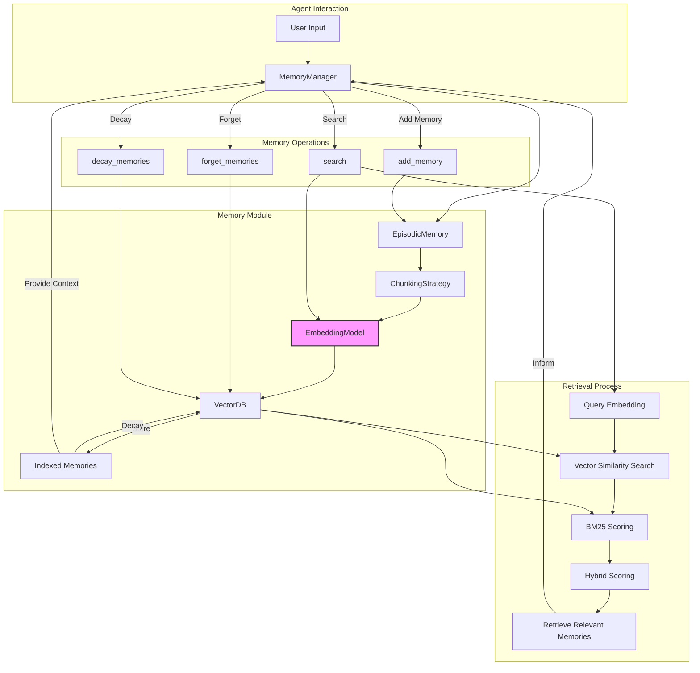

# memoryMODULE: AI Memory Management System

## Overview

memoryMODULE is an AI memory management system designed to handle the storage, retrieval, and manipulation of information in vector form. It provides mechanisms for memory formation, storage, retrieval, decay, and reinforcement.

## Key Components

1. **EmbeddingModel**: Converts text to vector representations using the OpenAI API.
2. **VectorDB**: Manages vector storage and retrieval, including similarity search and BM25 scoring.
3. **ChunkingStrategy**: Segments text into smaller units for processing.
4. **EpisodicMemory**: Represents individual memory units with associated metadata.
5. **MemoryManager**: Coordinates all memory operations.

## Core Functionality

### Memory Formation and Storage
- Text input is converted to vector representations.
- Vectors are stored in VectorDB with associated metadata.
- Memories are indexed for efficient retrieval.

### Memory Retrieval
- Utilizes a combination of vector similarity search and BM25 scoring.
- Retrieval factors include recency, importance, and relevance to the query.

### Memory Decay
- Implements a forgetting factor that reduces memory strength over time.
- Decay rate is configurable.

### Memory Reinforcement
- Allows for strengthening of memories based on access frequency or importance.

## Implementation Details

```python
class MemoryManager:
    def __init__(self, index_file: str = "memory_index.pkl", db_file: str = "vector_db.pkl"):
        # Initialization code

    def add_memory(self, agent_id: str, content: str, metadata: Dict[str, Any] = None, memory_id: str = None):
        # Memory addition logic

    def search(self, agent_id: str, query: str, top_k: int = 5) -> List[EpisodicMemory]:
        # Memory search implementation

    def forget_memories(self, agent_id: str, threshold: float):
        # Memory forgetting mechanism

    def decay_memories(self, agent_id: str, rate: float = 0.99):
        # Memory decay process
```

## Usage

```python
memory_manager = MemoryManager()
memory_manager.add_memory("agent1", "Information to store", {"importance": 0.8})
results = memory_manager.search("agent1", "Query for retrieval")
```

## Technical Specifications

- Vector Dimension: 768 (default, configurable)
- Similarity Measure: Cosine similarity
- Text Encoding: Uses GPT-2 tokenizer
- Persistence: Pickle-based storage for memory index and vector database

## Current Limitations

- Scalability constraints due to in-memory vector operations - only process vectors in batches to memory, rely on existing db
- Lack of distributed storage capabilities - refactor for sql hybrid operations
- Limited to text-based inputs - refactor for multi-modal inputs

## Ongoing Development

- Implementing more efficient database solutions
- Optimizing embedding model calls
- Developing more sophisticated chunking strategies
- Expanding test coverage and error handling
- Improving text processing with advanced regex methods

This system provides a framework for managing AI memory operations, focusing on vector-based storage and retrieval mechanisms. It is designed for integration into larger AI systems that require persistent and queryable memory capabilities.




## Implementation Notes

- The system uses a combination of vector similarity and BM25 scoring for memory retrieval.
- A forgetting factor is implemented to simulate natural memory decay over time.
- The system supports saving and loading of memories and the vector database for persistence.
- The `cosine_check_and_update` method in `VectorDB` ensures that similar memories are updated rather than duplicated.

## Work In Progress

- Refactoring for improved code structure and efficiency.
- Implementation of more robust database solutions to replace the current pickled-index system.
- Handling of embedding model calls with other API calls for improved performance.
- Implementation of a more careful and type-sensitive chunking strategy that aligns with the project's tokenizer.
- Writing comprehensive tests and analyzing logs for edge case handling.
- Development of regex methods for improved text processing.

This AI Memory Management System is designed to maintain an efficient and dynamic set of memories, prioritizing important and relevant information while allowing less significant memories to fade over time, similar to human memory processes.