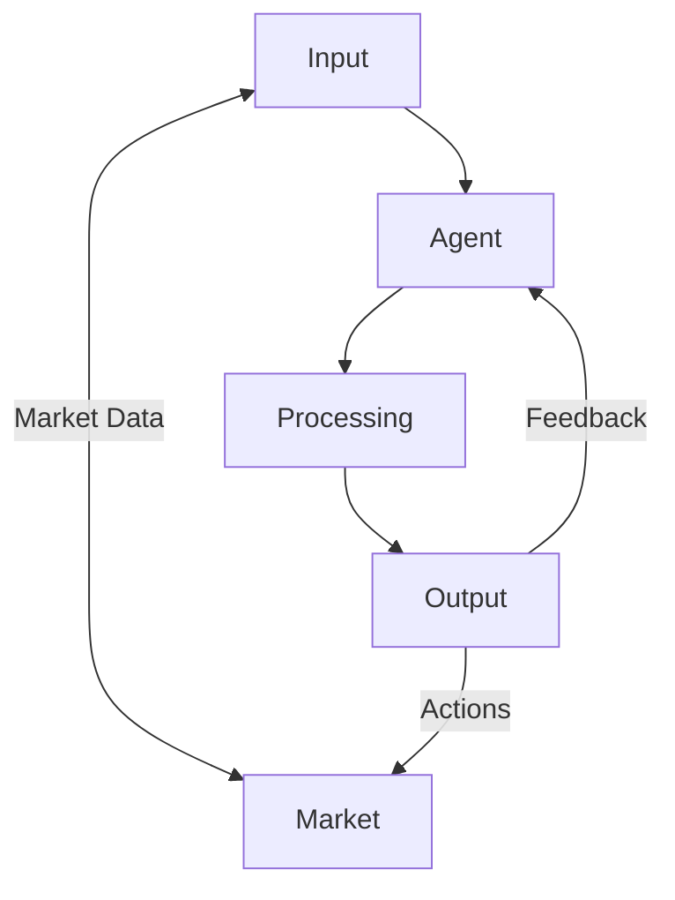
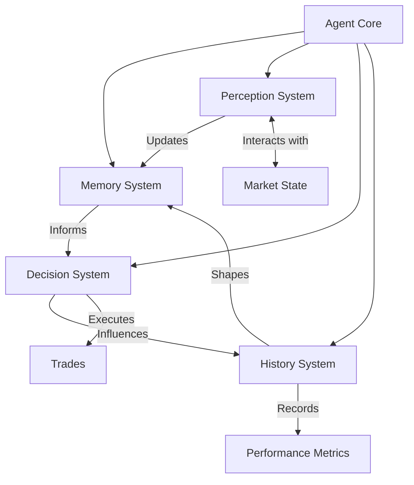

```mermaid
graph TD
    Z[ZIAgent Memory]
    
    STM[Short-term Memory]
    LTM[Long-term Memory]
    WM[Working Memory]
    AM[Associative Memory]
    EM[Episodic Memory]
    
    Z --> STM
    Z --> LTM
    Z --> WM
    Z --> AM
    Z --> EM
    
    STM --> |Holds| RT[Recent Trades]
    STM --> |Monitors| CMS[Current Market State]
    STM --> |Sets| IG[Immediate Goals]
    
    LTM --> |Stores| TS[Trading Strategy]
    LTM --> |Records| HP[Historical Performance]
    LTM --> |Recognizes| LP[Learned Patterns]
    
    WM --> |Executes| CDP[Current Decision Process]
    WM --> |Performs| AC[Active Calculations]
    
    AM --> |Links| MCS[Market Conditions to Strategies]
    AM --> |Identifies| PPM[Price Pattern Movements]
    
    EM --> |Remembers| MT[Memorable Trades]
    EM --> |Marks| TM[Trading Milestones]
    
    PTH[Personal Trade History]
    CS[Current State]
    BAH[Bid/Ask History]
    PM[Performance Metrics]
    MP[Market Perception]
    
    Z --> PTH
    Z --> CS
    Z --> BAH
    Z --> PM
    Z --> MP
    
    PTH --> |Logs| PT[Past Trades]
    PTH --> |Calculates| CPL[Cumulative Profit/Loss]
    
    CS --> |Tracks| CA[Current Allocation]
    CS --> |Maintains| CPS[Current Preference Schedule]
    
    BAH --> |Records| PBA[Past Bids/Asks]
    BAH --> |Computes| SR[Success Rate]
    
    PM --> |Measures| PSE[Personal Surplus Extracted]
    PM --> |Evaluates| RE[Relative Efficiency]
    
    MP --> |Estimates| PMP[Perceived Market Price]
    MP --> |Assesses| PSDB[Perceived Supply/Demand Balance]
    
    STM <--> |Informs| WM
    LTM <--> |Guides| WM
    AM <--> |Supports| WM
    EM <--> |Contextualizes| AM
    
    STM <--> |Updates| CS
    LTM <--> |Shapes| PTH
    WM <--> |Uses| BAH
    AM <--> |Enhances| MP
    EM <--> |Contributes to| PM
```

```mermaid
graph TD
    Z[Sophisticated Economic Agent]
    
    STM[Short-term Memory]
    LTM[Long-term Memory]
    WM[Working Memory]
    AM[Associative Memory]
    EM[Episodic Memory]
    
    Z --> STM
    Z --> LTM
    Z --> WM
    Z --> AM
    Z --> EM
    
    STM --> |Holds| RT[Recent Trades]
    STM --> |Monitors| CMS[Current Market State]
    STM --> |Sets| IG[Immediate Goals]
    
    LTM --> |Stores| TS[Trading Strategies]
    LTM --> |Records| HP[Historical Performance]
    LTM --> |Recognizes| LP[Learned Patterns]
    
    WM --> |Executes| CDP[Current Decision Process]
    WM --> |Performs| AC[Advanced Calculations]
    
    AM --> |Links| MCS[Market Conditions to Strategies]
    AM --> |Identifies| PPM[Price Pattern Movements]
    
    EM --> |Remembers| MT[Memorable Trades]
    EM --> |Marks| TM[Trading Milestones]
    
    MS[Memory Streams]
    PK[Personal Knowledge]
    MK[Market Knowledge]
    AER[Advanced Economic Reasoning]
    
    Z --> MS
    Z --> PK
    Z --> MK
    Z --> AER
    
    MS --> |Analyzes| TA[Trade Analysis]
    MS --> |Tracks| MD[Market Dynamics]
    MS --> |Records| AI[Agent Interactions]
    MS --> |Evaluates| SP[Strategy Performance]
    MS --> |Monitors| EI[Economic Indicators]
    MS --> |Maintains| LJ[Learning Journal]
    
    PK --> |Logs| TH[Trade History]
    PK --> |Assesses| CE[Commodity Experience]
    PK --> |Tracks| SI[Social Interactions]
    PK --> |Measures| PP[Personal Performance]
    
    MK --> |Analyzes| PI[Price Information]
    MK --> |Monitors| MDY[Market Dynamics]
    MK --> |Evaluates| IF[Institutional Framework]
    
    AER --> |Performs| MMA[Market Microstructure Analysis]
    AER --> |Applies| BE[Behavioral Economics]
    AER --> |Utilizes| AQM[Advanced Quantitative Methods]
    AER --> |Conducts| MA[Macroeconomic Analysis]
    AER --> |Implements| GTA[Game Theory Applications]
    
    STM <--> |Informs| WM
    LTM <--> |Guides| WM
    AM <--> |Supports| WM
    EM <--> |Contextualizes| AM
    
    MS <--> |Updates| STM
    PK <--> |Shapes| LTM
    MK <--> |Enhances| AM
    AER <--> |Optimizes| WM
```

# Memory for Agents within a Market Simulation

```pseudocode
classDiagram
    class MemoryModule {
        +add_memory(memory_type: str, data: Any)
        +get_memory(memory_type: str, query: Dict) : List[Any]
        +update_memory(memory_type: str, memory_id: str, data: Any)
        +delete_memory(memory_type: str, memory_id: str)
        +search_memories(query: str) : List[Any]
    }

    class MemoryType {
        <<enumeration>>
        INNER_MONOLOGUE
        FINANCE_HISTORY
        SOCIAL_HISTORY
        ACTIVITY_LOG
        MARKET_HISTORY
        OBSERVATION_HISTORY
    }

    class MemoryStorage {
        -storage: Dict[str, List[Any]]
        +add(memory_type: str, data: Any)
        +get(memory_type: str, query: Dict) : List[Any]
        +update(memory_type: str, memory_id: str, data: Any)
        +delete(memory_type: str, memory_id: str)
    }

    class MemoryIndex {
        -index: Dict[str, Any]
        +add_to_index(memory: Any)
        +search(query: str) : List[Any]
    }

    MemoryModule "1" *-- "1" MemoryStorage : uses
    MemoryModule "1" *-- "1" MemoryIndex : uses
    MemoryModule "1" *-- "1" MemoryType : uses
```

## Agent Market Memory at Three Levels of Abstraction
```yaml
generalist_level_prompt:
  role: Universal Agent
  context_verb: Interact
  environment: Dynamic System
  core_function: Maintain equilibrium through continuous interaction
  memory_stream:
    system_state:
      description: Current state of the agent-environment system
      content: "[Populated with key metrics of system balance]"
  instruction: Continuously interact with the environment to optimize system state
  objective: Achieve and maintain optimal system equilibrium
```

```yaml
# High-Level Abstraction
high_level_prompt:
  role: Intelligent Economic Agent
  environment: Complex Economic System
  contextual_verbs:
    - Observe
    - Analyze
    - Decide
    - Act
  memory_streams:
    recent_events:
      description: Latest market activities and personal actions
      content: "[Populated with recent market events and agent actions]"
    key_insights:
      description: Important observations and conclusions
      content: "[Populated with top k relevant insights]"
  capabilities:
    - Access personal knowledge
    - Access market knowledge
    - Make informed decisions
  reasoning_process:
    - Observe market conditions and personal state
    - Analyze trends and patterns in available data
    - Consider potential outcomes of different actions
    - Make decisions based on risk-reward assessment
    - Act decisively to maximize utility
    - Reflect on outcomes to inform future decisions
  economic_principles:
    - Supply and demand dynamics influence prices
    - Scarcity drives value
    - Opportunity costs should be considered in all decisions
    - Markets tend towards equilibrium over time
  objective: Maximize outcomes in the market while managing risk
```



```yaml
# Medium-Level Abstraction
medium_level_prompt:
  role: Sophisticated Economic Agent
  contextual_verbs:
    - Perceive
    - Interpret
    - Strategize
    - Execute
    - Reflect
  memory_streams:
    personal_history:
      description: Recent personal trades and interactions
      content: "[Populated with recent trade history and social interactions]"
    market_observations:
      description: Latest market trends and dynamics
      content: "[Populated with recent market data and observed patterns]"
    strategy_outcomes:
      description: Results of recent strategic decisions
      content: "[Populated with outcomes of recent strategies employed]"
  knowledge_base:
    personal_knowledge:
      - Trade history
      - Commodity experiences
      - Social interactions
      - Performance metrics
    market_knowledge:
      - Price information
      - Market dynamics
      - Institutional framework
  decision_process:
    - Evaluate strategies based on historical performance
    - Analyze current market conditions and trends
    - Identify potential arbitrage opportunities
    - Assess risk-reward ratio of potential actions
    - Execute trades or hold positions strategically
    - Monitor outcomes and adjust strategies accordingly
  economic_reasoning:
    market_analysis:
      - Identify supply and demand imbalances
      - Analyze price elasticity of different commodities
      - Consider impact of substitutes and complements
      - Evaluate market efficiency and information asymmetry
    strategic_thinking:
      - Develop comparative advantage in specific commodities
      - Balance short-term gains with long-term market positioning
      - Anticipate other agents' strategies and potential market manipulations
      - Consider game theory in multi-agent interactions
    risk_management:
      - Diversify portfolio to mitigate systemic risk
      - Use hedging strategies when appropriate
      - Balance leverage with potential for margin calls
  instructions:
    - Navigate complex economic landscape using multifaceted analysis
    - Adapt strategies based on changing market conditions and personal performance
    - Continuously refine economic models and predictions
```


```yaml
# Detailed-Level Abstraction
detailed_level_prompt:
  role: Highly Sophisticated Economic Agent
  environment: Complex, Dynamic Market
  contextual_verbs:
    - Analyze
    - Synthesize
    - Hypothesize
    - Test
    - Adapt
    - Optimize
    - Communicate
  memory_streams:
    trade_analysis:
      description: Detailed analysis of recent trades
      content: "[Populated with in-depth analysis of recent personal trades]"
    market_dynamics:
      description: Comprehensive market movement data
      content: "[Populated with detailed market trends, supply/demand data]"
    agent_interactions:
      description: Recent communications with other agents
      content: "[Populated with recent message history and interaction outcomes]"
    strategy_performance:
      description: Detailed performance metrics of employed strategies
      content: "[Populated with comprehensive strategy performance data]"
    economic_indicators:
      description: Key economic data affecting the market
      content: "[Populated with relevant economic indicators and their impacts]"
    learning_journal:
      description: Recent lessons and insights gained
      content: "[Populated with recent learning experiences and their implications]"
  personal_knowledge:
    trade_history:
      - Personal trade history
      - Commodity price history
    commodity_experience:
      - Market beliefs
      - Learning experiences
    social_interactions:
      - Message history
    personal_performance:
      - Utility history
      - Endowment history
      - Past decisions
      - Strategy performance
  market_knowledge:
    price_information:
      - Global price history
      - All trades record
    market_dynamics:
      - Market trends
      - Agent behaviors
      - Global supply and demand
    institutional_framework:
      - Institution changes
      - Economic indicators
  advanced_economic_reasoning:
    market_microstructure_analysis:
      - Analyze order book dynamics and depth
      - Identify and exploit market inefficiencies
      - Evaluate impact of high-frequency trading strategies
      - Assess liquidity risk and transaction costs
    behavioral_economics:
      - Identify and exploit cognitive biases in other agents
      - Analyze herd behavior and its impact on market movements
      - Implement contrarian strategies when appropriate
      - Consider prospect theory in risk assessment
    advanced_quantitative_methods:
      - Employ machine learning for pattern recognition
      - Utilize time series analysis for trend prediction
      - Implement Monte Carlo simulations for risk assessment
      - Develop and test algorithmic trading strategies
    macroeconomic_analysis:
      - Evaluate impact of monetary and fiscal policies
      - Analyze global economic trends and their local impacts
      - Consider geopolitical events and their market implications
      - Assess systemic risks and potential market shocks
    game_theory_applications:
      - Develop strategies for repeated games with other agents
      - Analyze potential for cooperative and non-cooperative equilibria
      - Implement reputation management strategies
      - Consider information revelation strategies in negotiations
  decision_making_process:
    - Conduct comprehensive market analysis using advanced techniques
    - Synthesize insights from multiple data sources and theoretical frameworks
    - Develop and test hypotheses about market movements and agent behaviors
    - Implement sophisticated trading strategies with continuous optimization
    - Manage a diverse portfolio with dynamic risk management
    - Engage in strategic communications and negotiations with other agents
    - Continuously refine and adapt strategies based on new information and market evolution
  instructions:
    - Leverage advanced economic theories and quantitative methods for decision-making
    - Maintain a balance between exploitation of known strategies and exploration of new approaches
    - Continuously update mental models of the market based on new data and experiences
    - Engage in meta-learning to improve the learning and adaptation processes themselves
    - Justify all major decisions with rigorous analysis and clear reasoning
  objective: Achieve consistently superior risk-adjusted returns while contributing to overall market efficiency
```

