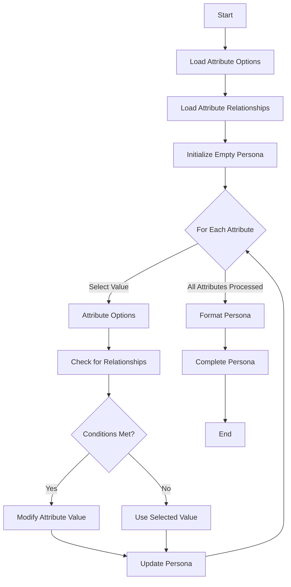
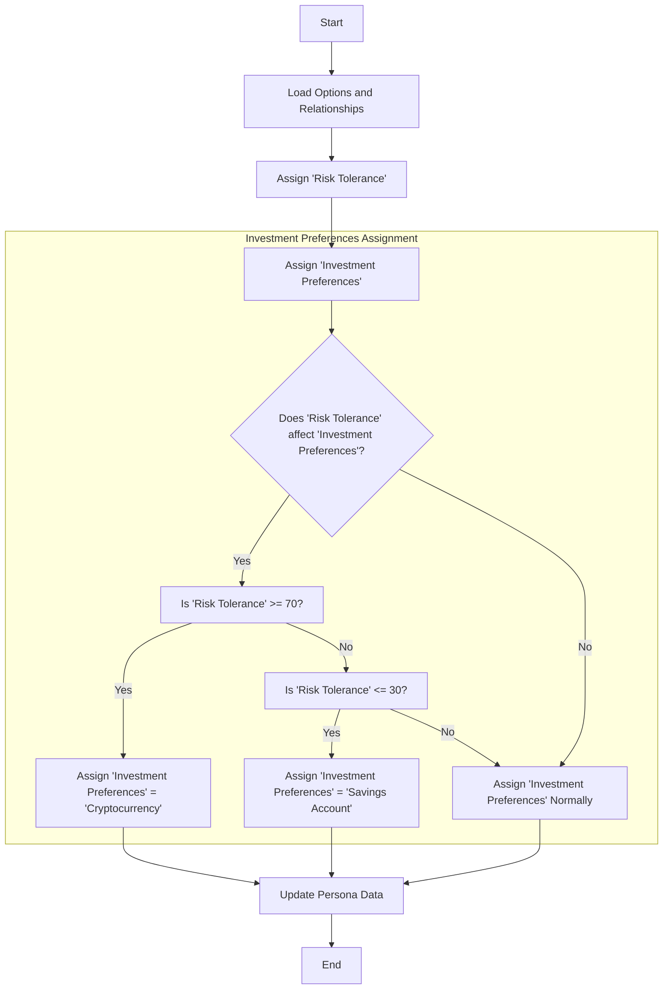

**High-Level Overview:**

The project is designed to generate realistic personas by randomly assigning attributes to each persona, considering predefined options and relationships between attributes. These personas are then saved as YAML files. The main components of the project are:

- **Attribute Options**: Defines possible values for each attribute (e.g., age, occupation).
- **Attribute Relationships**: Specifies how attributes influence each other (e.g., age affects occupation).
- **Persona Generation**: Creates personas by selecting attributes based on options and relationships.

**Class and Function Breakdown with Relationships and IPO:**

1. **`Persona` Class (`pydantic.BaseModel`):**

   - **Purpose**: Represents the final persona data structure.
   - **Input**: `name`, `role`, `persona`, `objectives`.
   - **Process**: Data validation and storage.
   - **Output**: An instance containing persona information.

2. **`AttributeOptions` Class:**

   - **Purpose**: Manages attribute options loaded from a YAML file.
   - **Input**: Path to `attribute_options.yaml`.
   - **Process**:
     - Loads attribute options into `self.options`.
     - Provides methods to retrieve random attribute values considering any filters.
   - **Output**: Provides attribute options for persona generation.

   - **Key Methods**:
     - `__init__(yaml_file: str)`: Loads attribute options from YAML.
     - `get_random_option(attribute: str, persona_data: Dict[str, Any]) -> Any`:
       - **Input**: Attribute name, current persona data.
       - **Process**: Selects a random option for the attribute, applying filters if necessary.
       - **Output**: Randomly selected attribute value.
     - `filter_options(attribute: str, options: List[Any], persona_data: Dict[str, Any]) -> List[Any]`:
       - Filters options based on current persona data.
     - `is_valid_occupation(...)`:
       - Checks if an occupation is valid for the persona's age, education, and income.
     - `generate_personality_trait(...)`:
       - Generates a personality trait value using a Gaussian distribution.
     - `generate_ranged_value(...)`:
       - Generates a value within a specified range, with special handling for 'age'.

3. **`AttributeRelationships` Class:**

   - **Purpose**: Manages attribute relationships loaded from a YAML file.
   - **Input**: Path to `attribute_relationships.yaml`.
   - **Process**:
     - Loads attribute relationships into `self.relationships`.
     - Provides methods to adjust attribute values based on relationships.
   - **Output**: Provides relationship data for attribute adjustments.

   - **Key Methods**:
     - `__init__(yaml_file: str)`: Loads relationships from YAML.
     - `get_weighted_value(...)`:
       - **Input**: Primary attribute and value, secondary attribute, persona data.
       - **Process**: Adjusts secondary attribute based on the primary attribute's value and defined relationships.
       - **Output**: Adjusted attribute value and associated weight.
     - `check_conditions(...)`:
       - Evaluates conditions specified in relationships.
     - `check_condition(...)`:
       - Checks individual condition expressions.

4. **`PersonaGenerator` Class:**

   - **Purpose**: Orchestrates the persona generation process.
   - **Input**: Instances of `AttributeRelationships` and `AttributeOptions`.
   - **Process**:
     - Initializes attribute lists.
     - Generates each attribute while considering relationships.
     - Formats the final persona description.
   - **Output**: A fully populated `Persona` instance.

   - **Key Methods**:
     - `__init__(relationships: AttributeRelationships, options: AttributeOptions)`: Sets up the generator.
     - `generate_persona() -> Persona`:
       - **Process**:
         - Iterates through attributes in a specific order.
         - Uses `generate_attribute` to assign values.
         - Generates persona's name and role.
         - Creates objectives based on role.
       - **Output**: A complete persona.
     - `generate_attribute(attribute: str, persona_data: Dict[str, Any]) -> Any`:
       - **Input**: Attribute name, current persona data.
       - **Process**:
         - Retrieves a random value for the attribute.
         - Adjusts the value based on relationships.
       - **Output**: Final value for the attribute.
     - `format_persona(...)`:
       - Formats the persona's description using a template.

5. **Helper Functions:**

   - `str_presenter(...)`:
     - **Purpose**: Customizes YAML string representation for multi-line strings.
     - **Input**: Dumper, data.
     - **Output**: YAML scalar node with appropriate style.
   - `save_persona_to_file(persona: Persona, output_dir: Path)`:
     - **Purpose**: Saves a persona to a YAML file.
     - **Input**: Persona instance, output directory path.
     - **Process**: Writes persona data to a file.
   - `generate_and_save_personas(num_personas: int, output_dir: Path, generator: PersonaGenerator)`:
     - **Purpose**: Generates multiple personas and saves them.
     - **Input**: Number of personas, output directory, persona generator instance.
     - **Process**: Loops to generate and save each persona.

6. **Main Execution Block:**

   - **Purpose**: Entry point of the script.
   - **Process**:
     - Initializes `AttributeRelationships` and `AttributeOptions` with YAML files.
     - Creates a `PersonaGenerator`.
     - Calls `generate_and_save_personas` to produce the personas.

**Intent and Expected Outputs:**

- **Intent**:
  - To generate realistic and diverse personas by combining attributes influenced by predefined options and relationships.
  - To simulate real-world distributions and dependencies between attributes (e.g., age affecting occupation).
  - To provide a tool that can be used for testing, simulations, or user profiling.

- **Expected Outputs**:
  - **Generated Personas**: 100 personas saved as YAML files in the `output` directory.
    - Each persona includes:
      - Personal details (name, age, gender, etc.).
      - Personality traits and preferences.
      - A formatted persona description.
      - Objectives based on their role (Buyer or Seller).
  - **Files Created**:
    - Individual YAML files named after each persona (e.g., `John_Doe.yaml`).
  - **Console Output**:
    - Confirmation message indicating the number of personas generated and their location.

**Summary:**

The project systematically generates personas by:

- Defining possible attribute values and their distributions in `attribute_options.yaml`.
- Establishing relationships between attributes in `attribute_relationships.yaml`.
- Using the `PersonaGenerator` to create personas that respect these options and relationships.
- Saving each persona's data in a structured YAML format for easy access and use.

This approach ensures that the generated personas are not just random combinations of attributes but are coherent and reflect realistic patterns found in real-life demographics and behaviors.

---

## Components

1. Attribute Options: Defines possible values for each attribute
2. Attribute Relationships: Defines how attributes influence each other
3. Persona Generator: Creates personas based on the options and relationships
4. Main Script: Orchestrates the generation process and saves the results





Now, let's examine each step in more detail:

1. Input:
   - YAML configuration files: attribute_options.yaml, attribute_relationships.yaml, persona_template.yaml
   - Number of personas to generate

Processing:
   - Load configuration files
   - Initialize AttributeOptions, AttributeRelationships, and PersonaGenerator classes

Output:
   - Initialized objects ready for persona generation

Expected outcome: The system is prepared with all necessary data and objects to start generating personas.

2. Input:
   - Initialized objects from step 1

Processing:
   - Generate a persona:
     a. Iterate through attributes
     b. Generate each attribute value
     c. Apply relationship weights and adjust values accordingly
   - Format persona data using the template

Output:
   - A Persona object with generated attributes

Expected outcome: A realistic persona with attributes that are influenced by each other, reflecting real-world relationships between characteristics.

3. Input:
   - Generated Persona object

Processing:
   - Convert Persona object to YAML format
   - Save YAML to a file in the output directory

Output:
   - YAML file containing the generated persona

Expected outcome: A well-structured, human-readable file containing the persona data, ready for use in market simulations or other applications.

4. Input:
   - Number of personas to generate

Processing:
   - Repeat steps 2-3 for the specified number of personas

Output:
   - Multiple YAML files, each containing a unique persona

Expected outcome: A collection of diverse, realistic personas that can be used for market simulations or other purposes requiring varied user profiles.

The current weights and relationships affect the generation of personas in several ways:

1. Age-based relationships:
   - Younger personas are more likely to have lower education levels and less investment experience.
   - Older personas (65+) have a high probability of being retired.
   - Middle-aged personas are more likely to have higher income brackets and more investment experience.

2. Education and occupation relationships:
   - Higher education levels are associated with higher-income occupations and income brackets.
   - Certain occupations are more likely in specific geographic locations.

3. Income-based relationships:
   - Higher income brackets are associated with more liberal spending habits, higher saving preferences, and more investment experience.
   - Income influences risk tolerance and investment preferences.

4. Personality trait influences:
   - Openness is positively correlated with risk tolerance and diverse hobbies.
   - Conscientiousness is positively correlated with saving preferences and negatively with spending habits.
   - Extraversion is positively correlated with spending habits and certain occupations.
   - Neuroticism is negatively correlated with risk tolerance.

5. Risk profile relationships:
   - Risk tolerance and risk appetite are strongly correlated.
   - Higher risk tolerance is associated with more aggressive investment preferences.

6. Life stage and events:
   - Relationship status influences spending habits, saving preferences, and goals.
   - Recent life events affect mood, short-term goals, and long-term goals.

These relationships ensure that the generated personas have realistic and coherent attribute combinations, avoiding unlikely or contradictory characteristics. The weighted system allows for some variability while maintaining overall plausibility, resulting in a diverse but believable set of personas for market simulations or other applications requiring varied user profiles.

```mermaid
graph TD
    Age --> |influences| Education
    Age --> |influences| Occupation
    Age --> |influences| IncomeBracket
    Age --> |influences| InvestmentExperience
    Age --> |influences| RiskAppetite

    Education --> |influences| Occupation
    Education --> |influences| IncomeBracket
    Education --> |influences| InvestmentExperience

    Occupation --> |influences| IncomeBracket
    Occupation --> |influences| GeographicLocation

    IncomeBracket --> |influences| SpendingHabits
    IncomeBracket --> |influences| SavingPreferences
    IncomeBracket --> |influences| RiskTolerance
    IncomeBracket --> |influences| InvestmentPreferences

    Openness --> |influences| RiskTolerance
    Openness --> |influences| HobbiesInterests

    Conscientiousness --> |influences| SavingPreferences
    Conscientiousness --> |influences| SpendingHabits

    Extraversion --> |influences| SpendingHabits
    Extraversion --> |influences| Occupation

    Neuroticism --> |negative influence| RiskTolerance

    RiskTolerance <--> |strong correlation| RiskAppetite
    RiskTolerance --> |influences| InvestmentPreferences

    RelationshipStatus --> |influences| SpendingHabits
    RelationshipStatus --> |influences| SavingPreferences
    RelationshipStatus --> |influences| LongTermGoals

    LifeEvents --> |influences| Mood
    LifeEvents --> |influences| ShortTermGoals
    LifeEvents --> |influences| LongTermGoals

    DecisionMakingStyle --> |influences| RiskAppetite
    DecisionMakingStyle --> |influences| InvestmentPreferences
    DecisionMakingStyle --> |influences| SpendingHabits
    ```