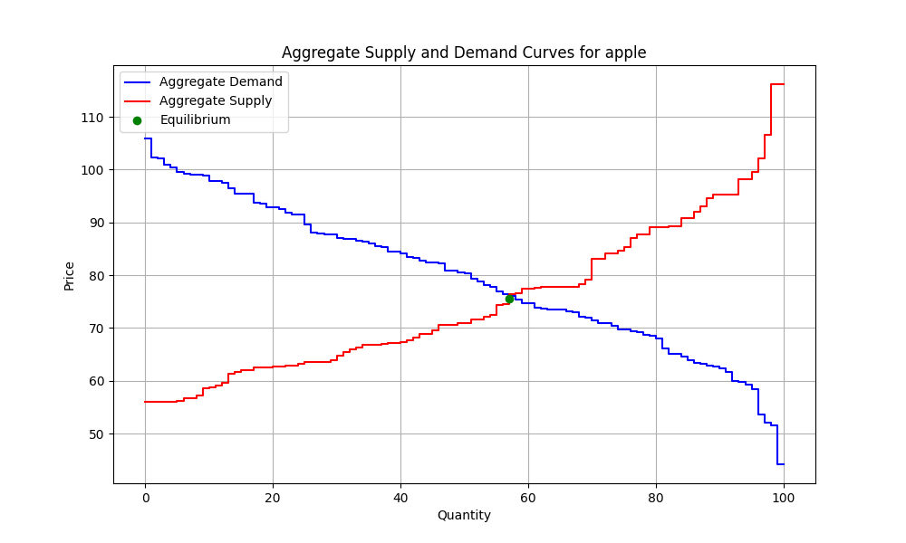
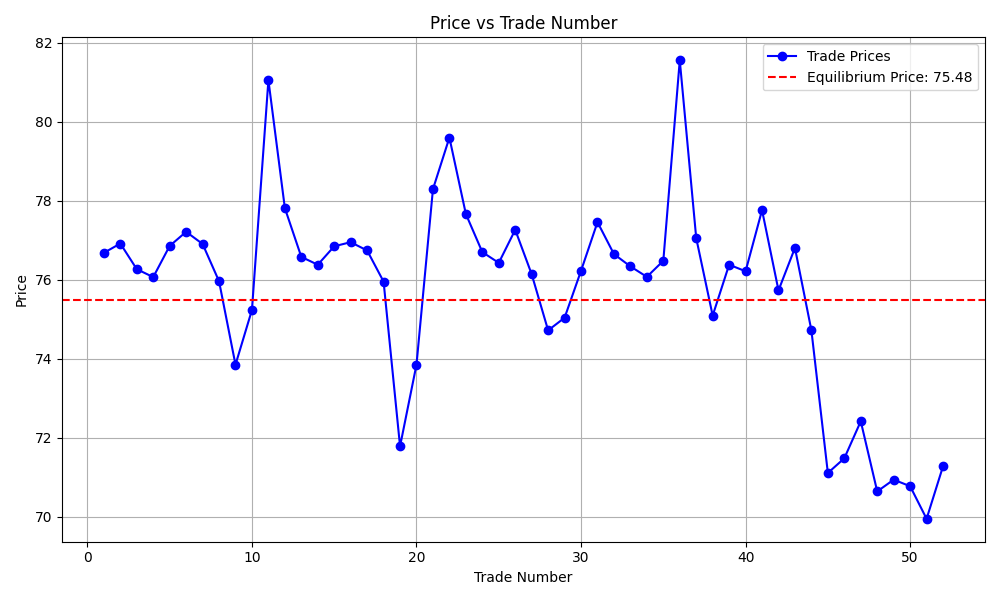
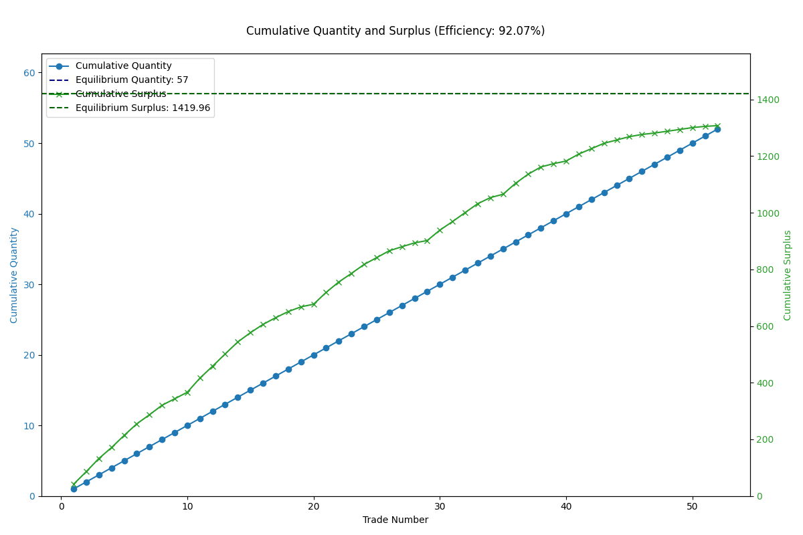

# Market Report

## Environment Summary
- **Number of Buyers**: 10
- **Number of Sellers**: 10
- **Total Rounds**: 100

## Market Summary
- **Total Successful Trades**: 52
- **Total Buyer Surplus**: 683.28
- **Total Seller Surplus**: 624.08
- **Total Surplus Extracted**: 1307.36
- **Average Price**: 75.71
- **Competitive Equilibrium Price**: 75.48
- **Competitive Equilibrium Quantity**: 57
- **Theoretical Total Surplus**: 1419.96
- **Practical Total Surplus**: 1307.36
- **Difference (Practical - Theoretical)**: -112.61
- **Final Efficiency**: 92.07%

## Equilibrium Supply and Demand Curves

## Price vs Trade Number

## Cumulative Quantity and Surplus

## Final Allocation of Agents

| Agent ID | Role   | Initial Goods | Initial Cash | Final Goods | Final Cash | Surplus |
|----------|--------|---------------|--------------|-------------|------------|---------|
| buyer_0 | Buyer | 0.0 | 500.00 | 3.0 | 277.94 | 22.67 |
| buyer_1 | Buyer | 0.0 | 500.00 | 6.0 | 56.26 | 45.92 |
| buyer_2 | Buyer | 0.0 | 500.00 | 3.0 | 280.82 | 23.13 |
| buyer_3 | Buyer | 0.0 | 500.00 | 6.0 | 39.18 | 86.25 |
| buyer_4 | Buyer | 0.0 | 500.00 | 6.0 | 51.92 | 55.81 |
| buyer_5 | Buyer | 0.0 | 500.00 | 6.0 | 31.77 | 119.86 |
| buyer_6 | Buyer | 0.0 | 500.00 | 6.0 | 41.70 | 91.90 |
| buyer_7 | Buyer | 0.0 | 500.00 | 6.0 | 42.52 | 102.78 |
| buyer_8 | Buyer | 0.0 | 500.00 | 6.0 | 39.40 | 93.86 |
| buyer_9 | Buyer | 0.0 | 500.00 | 4.0 | 201.53 | 41.11 |
| seller_0 | Seller | 10.0 | 0.00 | 5.0 | 382.49 | 56.72 |
| seller_1 | Seller | 10.0 | 0.00 | 7.0 | 227.58 | 35.94 |
| seller_2 | Seller | 10.0 | 0.00 | 5.0 | 381.70 | 44.44 |
| seller_3 | Seller | 10.0 | 0.00 | 7.0 | 223.89 | 29.96 |
| seller_4 | Seller | 10.0 | 0.00 | 3.0 | 537.58 | 103.89 |
| seller_5 | Seller | 10.0 | 0.00 | 6.0 | 300.63 | 46.26 |
| seller_6 | Seller | 10.0 | 0.00 | 8.0 | 147.70 | 12.18 |
| seller_7 | Seller | 10.0 | 0.00 | 0.0 | 746.05 | 111.94 |
| seller_8 | Seller | 10.0 | 0.00 | 5.0 | 380.94 | 66.92 |
| seller_9 | Seller | 10.0 | 0.00 | 2.0 | 608.41 | 115.83 |