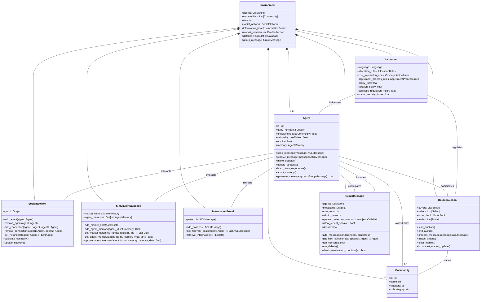
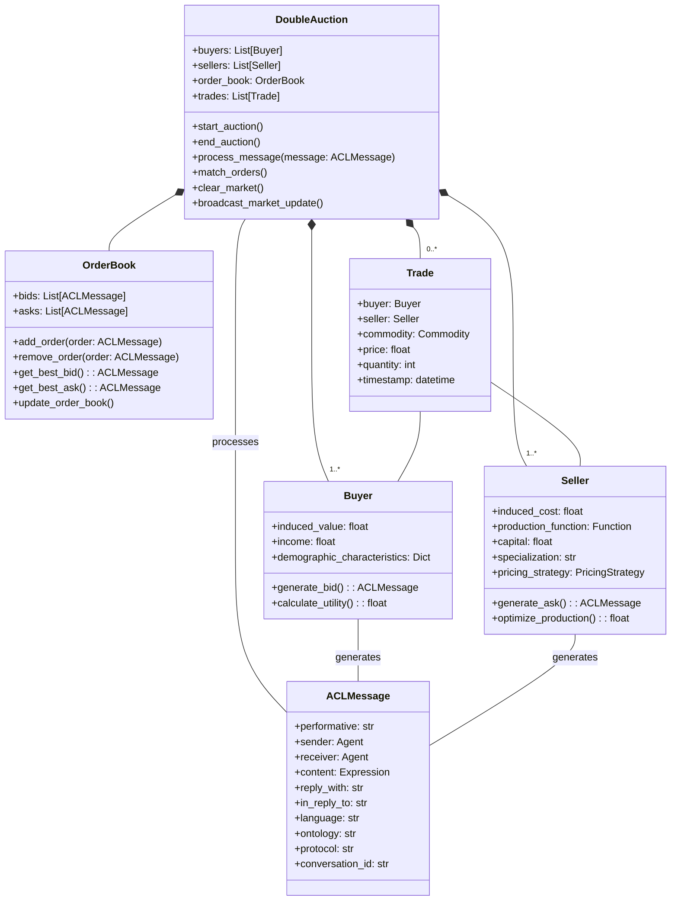
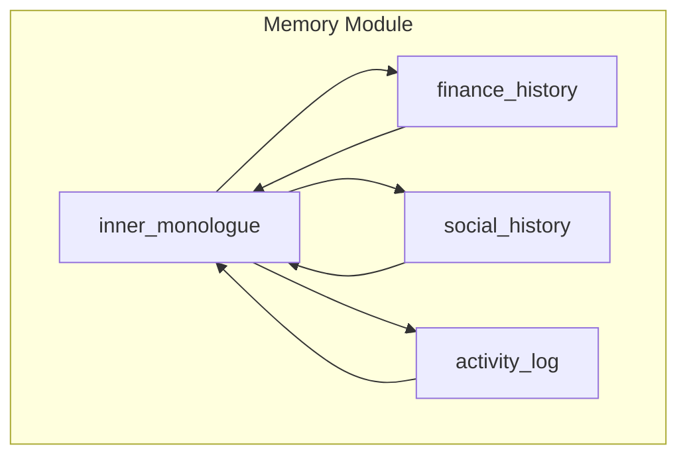

# MarketAgents
## Agent-based market simulation

  

MarketAgents is a microeconomic simulation framework designed to model agent-based market interactions. It includes features for simulating double auctions, tracking market dynamics, and modeling agent behavior. The framework is built to be extensible and adaptable for various economic experiments. This library is designed for implementing turn-based Double Auction simulations with literate economic agents capable of reading/writing news and communicating with each other. The library aims to study the role of news and information processing in the pricing dynamics of simulated virtual financial markets. Traditional economic models have struggled to acknowledge the role of information networks in price formation beyond simplistic implementations due to the inability to model human communication using natural language. The latest generation of LLMs now makes this possible.

This library seeks to merge and validate formal economic models of trade and learning with recent agent-based modeling capabilities. Large language models can implement, model, and formalize three fundamental aspects of realistic economic agents that have been known weaknesses of traditional economic models:

1. Information and communication beyond prices
2. In-context learning mimicking human behavior exhibited in experiments and actual markets
3. Bounded rationality through context overflow management and prompting choices

We anchor our simulation environment to the theoretical framework for modeling human experiments as Microeconomic Systems proposed by Nobel laureate Vernon L. Smith (1982). This framework's extensive use of information theory terminology offers an immediate connection to modern LLM theory and practice.

## Microeconomic Systems

A microeconomic system is a framework for modeling economic interactions between agents. It consists of two main components: an environment and an institution. The environment defines the characteristics of the economic agents, including their preferences, endowments, and technologies. The institution specifies the rules governing how agents can communicate and exchange goods or services. This framework allows economists to study how different environmental conditions and institutional rules impact economic outcomes and agent behavior.

## Double Auction

Double auctions are a specific type of microeconomic system commonly used in experimental economics and financial markets. In a double auction, buyers and sellers can simultaneously submit bids and offers for a single type of good. The environment typically consists of separate buyer and seller populations, each with their own induced values or costs for the good. The institutional rules allow participants to freely announce bids and offers, with trades occurring when a bid meets or exceeds an offer. This structure facilitates price discovery and efficient allocation of resources, making double auctions a powerful tool for studying market dynamics and testing economic theories.

| Proposition | Description |
|-------------|-------------|
| 4 | Allocations and prices in DA converge to levels near the competitive equilibrium (C.E.) prediction. This convergence is rapid, occurring in three to four trading periods or less with experienced subjects. |
| 5 | Convergence to C.E. prices and allocations occurs with as few as six to eight agents, and as few as two sellers. |
| 6 | Complete information on the theoretical supply and demand conditions is neither necessary nor sufficient for the rapid convergence property in DA. |
| 7 | Price convergence tends to be from above (below) the C.E. price when consumer's surplus is greater (smaller) than producer's surplus. |
| 8 | Experiments with one seller and five buyers do not achieve monopoly outcomes in DA, although some replications achieve the C.E. outcome. Buyers tend to withhold purchases, giving the seller a reduced profit. |
| 9 | Experiments with four buyers and four sellers where sellers (or buyers) are allowed to "conspire" do not converge to the monopoly (or monopsony) outcome in DA; neither do they seem to converge dependably to the C.E. |
| 10 | Binding price ceilings (floors) in DA yield contract price sequences which converge to the ceiling price from below (above). Non-binding price controls affect price dynamics but ultimately converge to C.E. |
| 11 | Asset markets with eight or nine agents in DA converge slowly toward the C.E. (rational expectations) price and efficiency. Convergence is hastened by introducing a futures market. |
| 12 | Asset markets with nine or twelve agents in DA, where some agents have insider information, converge toward the C.E. (rational expectations) price and efficiency. |

The table above summarizes key propositions from Vernon Smith's experimental studies on double auctions. These propositions highlight the robustness and efficiency of double auction markets under various conditions. Our aim is to replicate and potentially extend these findings using simulated agents, exploring how different levels of agent sophistication impact market dynamics and outcomes.

## Agents

In our simulation, we implement three distinct types of agents, each representing a different level of sophistication in decision-making and information processing. This approach allows us to compare market outcomes across a spectrum of agent capabilities, from the simplest random behavior to complex, language-model-driven strategies. By doing so, we can investigate how different degrees of agent intelligence and information processing affect market efficiency, price discovery, and the replication of empirical findings from human experiments. The three agent types are designed to capture key aspects of economic decision-making, from baseline random behavior to sophisticated, human-like reasoning.

### Zero Intelligence Agents

Zero Intelligence (ZI) agents represent the simplest form of market participants. These agents operate without strategic reasoning or learning capabilities. Instead, they generate random bids or asks within their budget constraints. ZI agents serve as a baseline model, demonstrating the minimum level of "intelligence" required for market function. Despite their simplicity, studies have shown that markets populated by ZI agents can still achieve near-efficient outcomes, highlighting the power of market institutions in guiding allocation decisions. These agents are particularly useful for isolating the effects of market structure from individual strategic behavior.

### Lookback Bayesian Agents

Lookback Bayesian agents introduce a level of strategic reasoning based on historical market data. These agents maintain a prior distribution of beliefs about market conditions and update these beliefs as new information becomes available. They make decisions by calculating expected values based on their current beliefs, effectively learning from past market outcomes. This approach allows for more sophisticated trading strategies that adapt to changing market conditions. Lookback Bayesian agents can capture phenomena such as price trend following or mean reversion, depending on their specific implementation. Their behavior more closely mimics real-world traders who use historical data to inform their decisions.

### LLM Agents

Large Language Model (LLM) agents represent the cutting edge in agent-based modeling for economic simulations. These agents leverage the power of language models to process complex information, learn in context, and make nuanced decisions. LLM agents can read and generate human-like messages, allowing for rich information exchange beyond simple price signals. Their working memory and history window can be adjusted to model different levels of bounded rationality. By controlling compression and summarization levels, we can simulate varying degrees of information processing capabilities. LLM agents can potentially exhibit sophisticated behaviors such as strategic communication, complex reasoning about market conditions, and adaptive learning that more closely resembles human decision-making in real markets.

## Institution

The `Institution` class represents the rules, norms, and structures that govern the economic system in the simulation. It encompasses various aspects of the economic environment that influence agent behavior and market dynamics such as monetary policy, fiscal policy and regulatory framework. 

Institution defines the "rules of the game" under which agents interact and markets operate. They encompass formal rules (like laws and regulations) and informal norms that shape economic behavior. In the context of double auctions and agent-based modeling, institutions determine critical aspects such as:

1. The language or protocol agents use to communicate bids, asks, and other market information.
2. Rules for allocating resources or matching buyers and sellers.
3. Cost structures and how they are imputed to different market participants.
4. Processes for market clearing and price adjustment.
5. Broader economic policies like interest rates, taxation, and business regulations.

By modifying institutional parameters, we can simulate different market structures, regulatory environments, and policy regimes, allowing for the study of their impacts on market efficiency, price discovery, and agent behavior. This flexibility makes the Institution class a powerful tool for exploring how different rules and norms affect market outcomes in various economic scenarios.

## Commodity

The `Commodity` class represents the goods and services that are traded within the microeconomic system. It is a fundamental component of the economic environment, serving as the objects of exchange between agents in the market.

Commodities in the microeconomic system simulation represent the various goods and services that agents can produce, consume, or trade. They are central to the economic interactions, forming the basis for supply and demand dynamics. In the context of double auctions and agent-based modeling, commodities are the items being bought and sold, with their characteristics influencing agent decisions and market outcomes.

The Commodity class plays a crucial role in the simulation by:

1. Defining the objects of trade in the market.
2. Allowing for the creation of diverse and complex economic environments with multiple types of goods.
3. Enabling the study of how different commodity characteristics affect market dynamics and agent behavior.
4. Facilitating the implementation of realistic economic scenarios with varied product markets.

By manipulating the properties and availability of commodities, we can simulate different market conditions, scarcity scenarios, and product innovations, providing a rich environment for economic experimentation and analysis.

# ACL Message Protocol in Multi-Agent Economic Simulation

In the context of a multi-agent economic simulation, particularly within a Double Auction framework, the Agent Communication Language (ACL) protocol plays a crucial role in facilitating interactions among agents. The ACL protocol, as defined by the Foundation for Intelligent Physical Agents (FIPA), provides a standardized method for agents to exchange information and perform actions in a consistent and interpretable manner.

## Key Components of ACL Messages

1. **Performative**: This field specifies the type of communicative act being performed, such as a request, inform, propose, or confirm. Each performative represents a different intention behind the message, guiding the receiving agent's response.

2. **Sender and Receiver**: These fields identify the agents involved in the communication. The sender field specifies the agent that initiates the message, while the receiver field indicates the intended recipient.

3. **Content**: The content field contains the actual information or request being communicated. This can be a simple string, a structured data format, or a complex expression in a formal language or ontology.

4. **Reply With and In Reply To**: These fields are used to manage conversations. The reply_with field provides a unique identifier for the message, which can be referenced by the in_reply_to field in subsequent messages to link replies to their original messages.

5. **Language and Ontology**: These fields define the syntax and semantics of the content. The language field specifies the formal language used to represent the content, while the ontology field defines the domain-specific vocabulary and concepts.

6. **Protocol**: This field indicates the interaction protocol being followed, ensuring that both agents understand the expected sequence of communicative acts.

7. **Conversation ID**: This field uniquely identifies a conversation thread, allowing agents to track and manage multiple ongoing interactions simultaneously.

## Example Usage in a Double Auction Framework

In a Double Auction framework, ACL messages facilitate various market interactions, such as submitting bids and offers, negotiating trades, and disseminating market information. Here is a typical example of how ACL messages are used in this context:

1. **Bid Submission**:
   * **Performative**: `PROPOSE`
   * **Sender**: `BuyerAgent1`
   * **Receiver**: `AuctioneerAgent`
   * **Content**: `{"commodity": "gold", "price": 1500, "quantity": 10}`
   * **Language**: `JSON`
   * **Ontology**: `MarketOntology`
   * **Protocol**: `DoubleAuctionProtocol`
   * **Conversation ID**: `conv1`

2. **Offer Submission**:
   * **Performative**: `PROPOSE`
   * **Sender**: `SellerAgent1`
   * **Receiver**: `AuctioneerAgent`
   * **Content**: `{"commodity": "gold", "price": 1550, "quantity": 5}`
   * **Language**: `JSON`
   * **Ontology**: `MarketOntology`
   * **Protocol**: `DoubleAuctionProtocol`
   * **Conversation ID**: `conv1`

3. **Trade Confirmation**:
   * **Performative**: `ACCEPT_PROPOSAL`
   * **Sender**: `AuctioneerAgent`
   * **Receiver**: `BuyerAgent1, SellerAgent1`
   * **Content**: `{"commodity": "gold", "price": 1525, "quantity": 5}`
   * **Language**: `JSON`
   * **Ontology**: `MarketOntology`
   * **Protocol**: `DoubleAuctionProtocol`
   * **Conversation ID**: `conv1`

4. **Market Update**:
   * **Performative**: `INFORM`
   * **Sender**: `AuctioneerAgent`
   * **Receiver**: `AllAgents`
   * **Content**: `{"update": "new_trade", "commodity": "gold", "price": 1525, "quantity": 5}`
   * **Language**: `JSON`
   * **Ontology**: `MarketOntology`
   * **Protocol**: `DoubleAuctionProtocol`
   * **Conversation ID**: `market_update1`

## CONTEXT MEMORIES FOR PIPING INTO AGENT PROMPTS

The Context Memory Framework is a crucial component of the agent-based economic simulation, providing agents with a structured way to store, retrieve, and utilize information from their experiences and observations. This framework enables more realistic and nuanced agent behavior by allowing them to learn from past experiences and adapt to changing market conditions.

Depending on the resolution the agents need, we should use a fast indexed search for fast recall of distant memories.

### Agent Context Memory:

1. *inner_monologue:* reflections on {activity_log} their {stats} and {mood}. reassess current {goals}.
2. *finance_history:* {transaction_history} {account balance} {assets}
3. *social_history:* {p2p chats with other agents} {chatroom/messageboard interactions}
4. *activity_log:* {sims sequence of their mundane tasks} {recent_actions} {needs_stats} {mood}

Has four distinct memory logs, masking some context while emphasising others through prompting.

### Financial Observor/and or Environment Context Memory:

1. *market_history:* {all_trades} {global_price} {global_supply_demand} {economic_indicators}
2. *observation_history:* {market_trends} {commentary} {agent_behaviour} {market_history} {chatlogs}

Has two memory tracks their previous observations and the holistic market overview.  

### Trackables:
- `personal_trade_history: A list of trades the agent has participated in`
- `commodity_price_history: Historical prices for each commodity the agent has interacted with`
- `past_decisions: A record of decisions made, including context and outcomes`
- `strategy_performance: Metrics on how well different strategies have performed`
- `social_interactions: A record of interactions with other agents`
- `market_beliefs: The agent's beliefs about different commodities in the market`
- `learning_experiences: Specific scenarios where the agent has learned something`
- `utility_history: A record of the agent's utility over time`
- `endowment_history: How the agent's endowment has changed over time`
- `message_history: A record of messages sent and received`
- `global_price_history: Historical prices for all commodities in the market`
- `all_trades: A record of all trades that have occurred in the market`
- `market_trends: Overall trends for each commodity`
- `agent_behaviors: Summary of behaviors for each agent in the market`
- `institution_changes: Record of changes to market institutions and their impacts`
- `global_supply_demand: Supply and demand information for each commodity`
- `economic_indicators: Various economic indicators relevant to the market`

### Group Message Module

The Group Message module introduces a new dimension of agent interaction to our multi-agent market simulation framework. This feature allows for group-based communication using the Agent Communication Language (ACL) protocol, enabling agents to engage in standardized collective discussions, share market insights, and influence each other's beliefs and strategies.

#### Key Features

* **ACL-Based Communication**: Utilize standardized ACL messages for group discussions, allowing for more nuanced and expressive communication.
* **Dynamic Group Conversations**: Facilitate multi-agent dialogues with configurable parameters such as maximum rounds and speaker selection methods.
* **Flexible Speaker Selection**: Choose from various methods to determine the next speaker, including automatic, manual, random, and round-robin selection.
* **Customizable Conversation Flow**: Set rules for speaker repetition and implement custom termination conditions for group discussions.
* **Integration with Agent Decision-Making**: ACL group messages can influence agent beliefs, strategies, and market behaviors, leading to more realistic market dynamics.
* **Conversation Tracking**: Unique conversation IDs allow for better organization and analysis of group discussions.

#### Debate Protocol

In addition to regular discussions and gossip, the Group Message module now supports structured debates using the ACL protocol. This feature allows agents to engage in more formal and rigorous exchanges of ideas, leading to potentially more informed decision-making and market dynamics.

Key aspects of the debate protocol:

* **Proposition and Challenge**: Agents can propose ideas (PROPOSE performative) and challenge others' propositions (QUERY-IF or DISCONFIRM performatives).
* **Verification**: Neutral agents can verify claims (CONFIRM or DISCONFIRM performatives), adding an element of fact-checking to debates.
* **Structured Rounds**: Debates follow a structured format with defined roles (e.g., proposer, challenger, verifier) and round limits.
* **Outcome Determination**: The debate concludes with a determination based on the strength of arguments and verification results.

#### Usage

To use the ACL-based Group Message module in your simulation:

1. Initialize a `GroupMessage` instance within your `Environment`.
2. Implement the `generate_group_message()` method in your `Agent` class to produce ACL messages for group discussions and debates.
3. Implement the `receive_group_message()` method in your `Agent` class to process incoming ACL messages.
4. Call `run_conversation()` or `run_debate()` on your `GroupMessage` instance at appropriate points in your simulation loop.
5. Process the outcomes of group conversations and debates to update agent states and market conditions.

### Information Board
The Information Board serves as a centralized repository for economic news and statistics, simulating the dissemination of public information within the economy. This component plays a crucial role in the MarketAgents framework by:

1. Generating and distributing economic news based on current market states and exogenous factors.
2. Implementing information dissemination mechanisms with variable reach and impact.
3. Simulating information decay and relevance scoring to model the changing importance of information over time.

The Information Board allows for the study of how information flow affects market dynamics and agent decision-making, providing a more realistic simulation of information asymmetry and its effects on economic outcomes.

### Social Network Graph
The social network component in the MarketAgents framework models the interconnections and relationships between agents in the simulated economy. It plays a crucial role in capturing the effects of social interactions, information diffusion, and network externalities on market dynamics. The social network influences how information spreads, how agents form opinions, and how they make economic decisions based on their connections.

### Market History
The Market History component serves as a comprehensive repository of all market-related data over time. It plays a crucial role in the MarketAgents framework by:

1. Recording and maintaining historical price data for all commodities traded in the market.
2. Tracking all trades that have occurred, including details such as parties involved, quantities, and prices.
3. Storing global economic indicators and market trends over time.
4. Providing efficient methods for querying and analyzing historical market data.
5. Supporting the calculation of various market metrics and performance indicators.

The Market History allows for in-depth analysis of market dynamics, enables the study of long-term trends, and provides agents with a rich dataset for informing their decision-making processes.

### Simulation Database
The Simulation Database acts as the central data management system for the entire economic simulation. It integrates various data components, including Market History and agent memories. Key aspects of the Simulation Database include:

1. Providing a unified interface for data storage and retrieval across all simulation components.
2. Managing both market-wide historical data and individual agent memories efficiently.
3. Supporting complex queries that can span across different data types and time periods.
4. Enabling data persistence and recovery, allowing simulations to be paused, resumed, or replayed.
5. Facilitating the implementation of learning algorithms and adaptive strategies by providing easy access to historical data.
6. Supporting the generation of comprehensive reports and visualizations for analysis.

The Simulation Database enhances the overall performance and capabilities of the simulation by centralizing data management, thereby allowing for more sophisticated agent behaviors, market analyses, and experimental scenarios.

# Design and Implementation

```mermaid
classDiagram
    class MicroeconomicSystem {
        +environment: Environment
        +institution: Institution
        +run_simulation()
        +generate_reports()
    }
    class Environment {
        +agents: List[Agent]
        +commodities: List[Commodity]
        +time: int
        +social_network: SocialNetwork
        +information_board: InformationBoard
        +market_mechanism: DoubleAuction
        +database: SimulationDatabase
        +group_message: GroupMessage
    }
    class Institution {
        +language: Language
        +allocation_rules: AllocationRules
        +cost_imputation_rules: CostImputationRules
        +adjustment_process_rules: AdjustmentProcessRules
        +policy_rate: float
        +taxation_policy: float
        +business_regulation_index: float
        +social_security_index: float
    }
    class Agent {
        +id: int
        +utility_function: Function
        +endowment: Dict[Commodity, float]
        +rationality_coefficient: float
        +epsilon: float
        +memory: AgentMemory
        +send_message(message: ACLMessage)
        +receive_message(message: ACLMessage)
        +make_decision()
        +update_strategy()
        +learn_from_experience()
        +adapt_strategy()
    }
    class AgentMemory {
        +inner_monologue: List[str]
        +finance_history: List[Dict]
        +social_history: List[Dict]
        +activity_log: List[Dict]
        +add_inner_monologue(thought: str)
        +add_finance_event(event: Dict)
        +add_social_interaction(interaction: Dict)
        +add_activity(activity: Dict)
        +get_memory(memory_type: str, time_range: Tuple[int, int]): List
    }
    class SocialNetwork {
        +graph: Graph
        +add_agent(agent: Agent)
        +remove_agent(agent: Agent)
        +add_connection(agent1: Agent, agent2: Agent)
        +remove_connection(agent1: Agent, agent2: Agent)
        +get_neighbors(agent: Agent): List[Agent]
        +calculate_centrality()
        +update_network()
    }
    class SimulationDatabase {
        +market_history: MarketHistory
        +agent_memories: Dict[int, AgentMemory]
        +add_market_data(data: Dict)
        +add_agent_memory(agent_id: int, memory: Dict)
        +get_market_data(time_range: Tuple[int, int]): List[Dict]
        +get_agent_memory(agent_id: int, memory_type: str): Dict
        +update_agent_memory(agent_id: int, memory_type: str, data: Dict)
    }
    class Buyer {
        +induced_value: float
        +income: float
        +demographic_characteristics: Dict
        +generate_bid(): ACLMessage
        +calculate_utility(): float
    }
    class Seller {
        +induced_cost: float
        +production_function: Function
        +capital: float
        +specialization: str
        +pricing_strategy: PricingStrategy
        +generate_ask(): ACLMessage
        +optimize_production(): float
    }
    class Commodity {
        +id: int
        +name: str
        +category: str
        +subcategory: str
    }
    class ACLMessage {
        +performative: str
        +sender: Agent
        +receiver: Agent
        +content: Expression
        +reply_with: str
        +in_reply_to: str
        +language: str
        +ontology: str
        +protocol: str
        +conversation_id: str
    }
    class Language {
        +valid_messages: List[str]
    }
    class AllocationRules {
        +determine_allocation(bids: List[ACLMessage], asks: List[ACLMessage]): List[Trade]
    }
    class CostImputationRules {
        +calculate_costs(trades: List[Trade])
    }
    class AdjustmentProcessRules {
        +start_rule()
        +transition_rule()
        +stopping_rule()
    }
    class DoubleAuction {
        +buyers: List[Buyer]
        +sellers: List[Seller]
        +order_book: OrderBook
        +trades: List[Trade]
        +start_auction()
        +end_auction()
        +process_message(message: ACLMessage)
        +match_orders()
        +clear_market()
        +broadcast_market_update()
    }
    class OrderBook {
        +bids: List[ACLMessage]
        +asks: List[ACLMessage]
        +add_order(order: ACLMessage)
        +remove_order(order: ACLMessage)
        +get_best_bid(): ACLMessage
        +get_best_ask(): ACLMessage
        +update_order_book()
    }
    class Trade {
        +buyer: Buyer
        +seller: Seller
        +commodity: Commodity
        +price: float
        +quantity: int
        +timestamp: datetime
    }
    class MarketHistory {
        +price_history: Dict[int, Dict[int, float]]
        +trade_history: List[Trade]
        +global_indicators: Dict[str, List[float]]
        +add_price(commodity_id: int, time: int, price: float)
        +add_trade(trade: Trade)
        +update_indicators(indicators: Dict[str, float])
        +get_price_history(commodity_id: int, time_range: Tuple[int, int]): List[float]
        +get_trades(time_range: Tuple[int, int]): List[Trade]
        +get_indicators(indicator: str, time_range: Tuple[int, int]): List[float]
    }
    class InformationBoard {
        +posts: List[BoardMessage]
        +add_post(post: BoardMessage)
        +get_relevant_posts(relevant_topics: List[str]): List[BoardMessage]
        +retrieve_information(): List[str]
    }
    class BoardMessage {
        +message: ACLMessage
        +date_posted: datetime
        +title: Optional[str]
    }
    class GroupMessage {
        +agents: List[Agent]
        +messages: List[Dict]
        +max_round: int
        +admin_name: str
        +speaker_selection_method: Union[str, Callable]
        +allow_repeat_speaker: bool
        +debate: bool
        +add_message(sender: Agent, content: str)
        +get_next_speaker(last_speaker: Agent): Agent
        +run_conversation()
        +run_debate()
        +check_termination_condition(): bool
    }

    MicroeconomicSystem *-- Environment
    MicroeconomicSystem *-- Institution
    Environment *-- "1..*" Agent
    Environment *-- "1..*" Commodity
    Environment *-- InformationBoard
    Environment *-- DoubleAuction
    Environment *-- SocialNetwork
    Environment *-- SimulationDatabase
    Environment *-- GroupMessage
    Agent <|-- Buyer
    Agent <|-- Seller
    Agent -- ACLMessage
    Agent *-- AgentMemory
    Institution *-- Language
    Institution *-- AllocationRules
    Institution *-- CostImputationRules
    Institution *-- AdjustmentProcessRules
    DoubleAuction *-- OrderBook
    DoubleAuction *-- "0..*" Trade
    DoubleAuction -- AllocationRules
    Trade -- Commodity
    InformationBoard *-- "0..*" BoardMessage
    BoardMessage *-- ACLMessage
    Agent -- InformationBoard: interacts
    DoubleAuction -- ACLMessage: processes
    SimulationDatabase *-- MarketHistory
    SimulationDatabase *-- "1..*" AgentMemory
    MarketHistory *-- "0..*" Trade
    MarketHistory -- Commodity: tracks
    SocialNetwork -- "2..*" Agent: connects
    GroupMessage -- "2..*" Agent: involves
```

## Core Modules

### MicroeconomicSystem
The MicroeconomicSystem class serves as the main controller for the simulation, integrating the environment and institution components.

Key Attributes:
- `environment`: Environment
- `institution`: Institution

Key Methods:
- `run_simulation()`
- `generate_reports()`

### Environment
The Environment class represents the economic context in which agents operate.

Key Attributes:
- `agents`: List[Agent]
- `commodities`: List[Commodity]
- `time`: int
- `social_network`: Graph
- `information_board`: InformationBoard

### Institution
The Institution class defines the rules and structures governing economic interactions.

Key Attributes:
- `language`: Language
- `allocation_rules`: AllocationRules
- `cost_imputation_rules`: CostImputationRules
- `adjustment_process_rules`: AdjustmentProcessRules
- `policy_rate`: float
- `taxation_policy`: float
- `business_regulation_index`: float
- `social_security_index`: float

### Agent
The Agent class serves as the base class for economic actors in the simulation.

Key Attributes:
- `id`: int
- `utility_function`: Function
- `endowment`: Dict[Commodity, float]
- `rationality_coefficient`: float
- `epsilon`: float
- `memory`: MarketMemory

Key Methods:
- `send_message(message: ACLMessage)`
- `receive_message(message: ACLMessage)`
- `make_decision()`
- `update_strategy()`
- `learn_from_experience()`
- `adapt_strategy()`

#### Buyer
The Buyer class represents agents who purchase commodities.

Key Attributes:
- `induced_value`: float
- `income`: float
- `demographic_characteristics`: Dict

Key Methods:
- `generate_bid(): ACLMessage`
- `calculate_utility(): float`

#### Seller
The Seller class represents agents who sell commodities.

Key Attributes:
- `induced_cost`: float
- `production_function`: Function
- `capital`: float
- `specialization`: str
- `pricing_strategy`: PricingStrategy

Key Methods:
- `generate_ask(): ACLMessage`
- `optimize_production(): float`

### Commodity
The Commodity class represents the goods or services traded in the market.

Key Attributes:
- `id`: int
- `name`: str
- `category`: str
- `subcategory`: str

### Market Mechanisms

#### DoubleAuction
The DoubleAuction class implements the double auction market mechanism.

Key Attributes:
- `buyers`: List[Buyer]
- `sellers`: List[Seller]
- `order_book`: OrderBook
- `trades`: List[Trade]

Key Methods:
- `start_auction()`
- `end_auction()`
- `process_message(message: ACLMessage)`
- `match_orders()`
- `clear_market()`
- `broadcast_market_update()`

#### OrderBook
The OrderBook class manages the list of bids and asks in the market.

Key Attributes:
- `bids`: List[ACLMessage]
- `asks`: List[ACLMessage]

Key Methods:
- `add_order(order: ACLMessage)`
- `remove_order(order: ACLMessage)`
- `get_best_bid(): ACLMessage`
- `get_best_ask(): ACLMessage`
- `update_order_book()`

### Communication Protocol

#### ACLMessage
The ACLMessage class implements the FIPA Agent Communication Language specification.

Key Attributes:
- `performative`: str
- `sender`: Agent
- `receiver`: Agent
- `content`: Expression
- `reply_with`: str
- `in_reply_to`: str
- `language`: str
- `ontology`: str
- `protocol`: str
- `conversation_id`: str

### Data Collection and Analysis

#### SimulationDatabase
The SimulationDatabase class serves as the central repository for all historical data in the simulation, including market-wide information and individual agent memories.

Key Attributes:
- `market_history`: MarketHistory
- `agent_memories`: Dict[int, AgentMemory]

Key Methods:
- `add_market_data(data: Dict)`
- `add_agent_memory(agent_id: int, memory: Dict)`
- `get_market_data(time_range: Tuple[int, int]): List[Dict]`
- `get_agent_memory(agent_id: int, memory_type: str): Dict`
- `update_agent_memory(agent_id: int, memory_type: str, data: Dict)`

#### MarketHistory
The MarketHistory class maintains comprehensive records of market-wide activities and economic indicators over time.

Key Attributes:
- `price_history`: Dict[int, Dict[int, float]]
- `trade_history`: List[Trade]
- `global_indicators`: Dict[str, List[float]]

Key Methods:
- `add_price(commodity_id: int, time: int, price: float)`
- `add_trade(trade: Trade)`
- `update_indicators(indicators: Dict[str, float])`
- `get_price_history(commodity_id: int, time_range: Tuple[int, int]): List[float]`
- `get_trades(time_range: Tuple[int, int]): List[Trade]`
- `get_indicators(indicator: str, time_range: Tuple[int, int]): List[float]`

#### AgentMemory
The AgentMemory class represents an individual agent's memory, storing various types of experiences and observations.

Key Attributes:
- `inner_monologue`: List[str]
- `finance_history`: List[Dict]
- `social_history`: List[Dict]
- `activity_log`: List[Dict]

Key Methods:
- `add_inner_monologue(thought: str)`
- `add_finance_event(event: Dict)`
- `add_social_interaction(interaction: Dict)`
- `add_activity(activity: Dict)`
- `get_memory(memory_type: str, time_range: Tuple[int, int]): List`

#### GroupMessage

The GroupMessage class facilitates group discussions and debates among agents in the simulation.

Key Attributes:

* `agents`: List[Agent] - The list of agents participating in the group discussion or debate.
* `messages`: List[Dict] - A record of all messages sent during the conversation.
* `max_round`: int - The maximum number of rounds for the conversation or debate.
* `admin_name`: str - The name of the administrator managing the group discussion or debate.
* `speaker_selection_method`: Union[str, Callable] - Method for selecting the next speaker (e.g., "random", "round-robin", or a custom function).
* `allow_repeat_speaker`: bool - Whether a speaker can speak multiple times in a row.
* `debate`: bool - Indicates whether the group message instance is running a debate.

Key Methods:

* `add_message(sender: Agent, content: str)` - Adds a new message to the conversation.
* `get_next_speaker(last_speaker: Agent): Agent` - Determines the next speaker based on the selection method.
* `run_conversation()` - Manages the flow of the group discussion.
* `run_debate()` - Manages the flow of the debate.
* `check_termination_condition(): bool` - Checks if the conversation should be terminated.

#### BoardMessage

Tha BoardMessage class is a wrapper around ACLMessage for ease of use in the InformationBoard.

Key Attributes:

- `message`: ACLMessage
- `date_posted`: datetime
- `title`: Optional[str]

#### InformationBoard
The InformationBoard class serves as a centralized repository for economic news and statistics.

Key Attributes:
- `posts`: List[BoardMessage]

Key Methods:
- `add_post(post: BoardMessage)`
- `get_relevant_posts(relevant_topics: List[str]): List[BoardMessage]`
- `retrieve_information(): List[str]`

#### SocialNetwork
The SocialNetwork class represents the social structure of the agents in the simulation. It uses a graph data structure to model connections between agents and provides methods for manipulating and analyzing the network.

Key Attributes:
- `graph: Graph - The underlying graph structure representing agent connections`

Key Methods:

- `add_agent(agent: Agent): Adds a new agent to the social network`
- `remove_agent(agent: Agent): Removes an agent from the social network`
- `add_connection(agent1: Agent, agent2: Agent): Creates a connection between two agents`
- `remove_connection(agent1: Agent, agent2: Agent): Removes the connection between two agents`
- `get_neighbors(agent: Agent): List[Agent]: Returns a list of agents connected to the given agent`
- `calculate_centrality(): Computes various centrality measures for agents in the network`
- `update_network(): Updates the network structure based on agent interactions and market events`

### Additional Components

#### Language
The Language class defines the valid messages and communication rules.

Key Attributes:
- `valid_messages`: List[str]

#### AllocationRules
The AllocationRules class determines how resources are allocated based on market interactions.

Key Methods:
- `determine_allocation(bids: List[ACLMessage], asks: List[ACLMessage]): List[Trade]`

#### CostImputationRules
The CostImputationRules class defines how costs are calculated and assigned.

Key Methods:
- `calculate_costs(trades: List[Trade])`

#### AdjustmentProcessRules
The AdjustmentProcessRules class governs how the market adjusts over time.

Key Methods:
- `start_rule()`
- `transition_rule()`
- `stopping_rule()`

#### Trade
The Trade class represents a completed transaction between a buyer and a seller.

Key Attributes:
- `buyer`: Buyer
- `seller`: Seller
- `price`: float
- `quantity`: int
- `timestamp`: datetime

### Distributed inferencing

Depending on the underlying LLM models that would pilot the Agents, if using a model by self-hosting or manage manually the infrastructure, a distributed inference strategy and framework might have to be chosen, for instance:

- If the model is too large for single-nodes, the inferencing would need to be distributed between several nodes with multiple GPUs
- If the model size fits multiple GPU-cards in a single-host, distributed inferencing and tensor split could be done locally on the same machine
- If the model size fits single GPU-cards, we can rely on distributing the inference and load-balancing requests between different nodes.

Given the high load and speed required by the agent model to simulate a population, it is required at least to load-balance requests across multiple instances. A benchmarking phase would be appropriate to understand the infrastructure requirements based on the simulation size.

Load balancing can be achieved by using container orchestration frameworks such as Kubernetes, or by using a custom load balancer that distributes requests based on the load of each node (for instance, HAProxy, nginx, and similar), alternatively, we can explore a more specific Load Balancing strategy which is more tight to the inferencing engine that is used (for example by looking at the node's free batch queues, and which ones are currently busy in inferencing and have no free slots).

The choice of the framework depends on the specific requirements of the simulation and the available infrastructure, as well as the desired level of automation and scalability that will be evaluated after an initial benchmarking phase.

Projects that supports distributed inference and fullfill the requirements above are (not exhaustive list):

- vLLM ( https://docs.vllm.ai/en/latest/serving/distributed_serving.html#multi-node-inference-and-serving )
- LocalAI ( https://localai.io/features/distribute/ )

To note, the frameworks needs to implement an API that allows to use functions calls, tools, or similar requirements (e.g. by using BNF grammars) to allow model the operations of the Agents.
