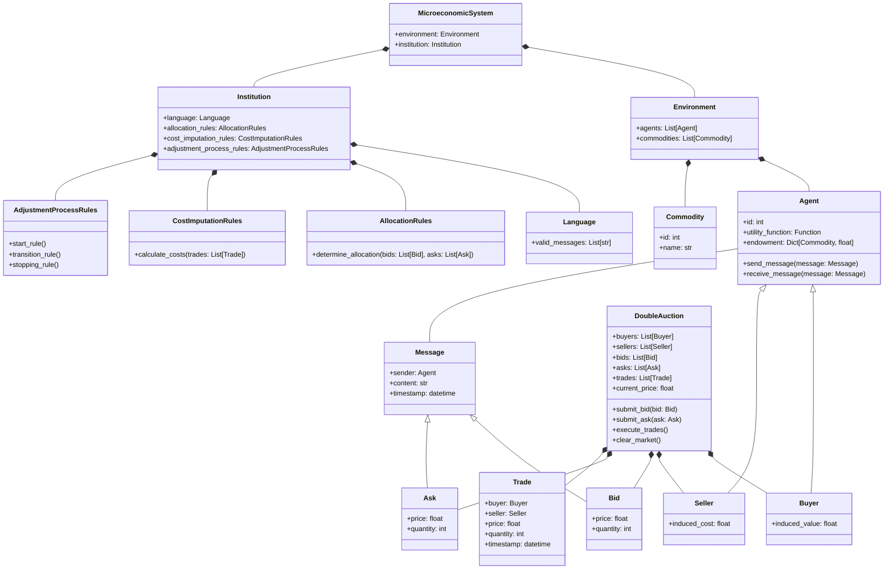
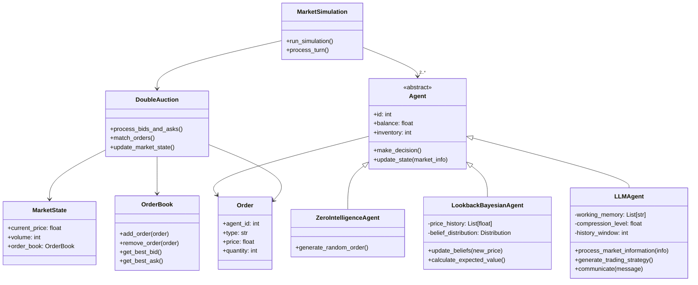

# Litecon

Litecon is a library for implementing turn-based Double Auction simulations with literate economic agents capable of reading/writing news and communicating with each other. The library aims to study the role of news and information processing in the pricing dynamics of simulated virtual financial markets. Traditional economic models have struggled to acknowledge the role of information networks in price formation beyond simplistic implementations due to the inability to model human communication using natural language. The latest generation of LLMs now makes this possible.

This library seeks to merge and validate formal economic models of trade and learning with recent agent-based modeling capabilities. Large language models can implement, model, and formalize three fundamental aspects of realistic economic agents that have been known weaknesses of traditional economic models:

1. Information and communication beyond prices
2. In-context learning mimicking human behavior exhibited in experiments and actual markets
3. Bounded rationality through context overflow management and prompting choices

We anchor our simulation environment to the theoretical framework for modeling human experiments as Microeconomic Systems proposed by Nobel laureate Vernon L. Smith (1982). This framework's extensive use of information theory terminology offers an immediate connection to modern LLM theory and practice.

## Microeconomic Systems

A microeconomic system is a framework for modeling economic interactions between agents. It consists of two main components: an environment and an institution. The environment defines the characteristics of the economic agents, including their preferences, endowments, and technologies. The institution specifies the rules governing how agents can communicate and exchange goods or services. This framework allows economists to study how different environmental conditions and institutional rules impact economic outcomes and agent behavior.

## Double Auction

Double auctions are a specific type of microeconomic system commonly used in experimental economics and financial markets. In a double auction, buyers and sellers can simultaneously submit bids and offers for a single type of good. The environment typically consists of separate buyer and seller populations, each with their own induced values or costs for the good. The institutional rules allow participants to freely announce bids and offers, with trades occurring when a bid meets or exceeds an offer. This structure facilitates price discovery and efficient allocation of resources, making double auctions a powerful tool for studying market dynamics and testing economic theories.

## Design and Implementation

| Proposition | Description |
|-------------|-------------|
| 4 | Allocations and prices in DA converge to levels near the competitive equilibrium (C.E.) prediction. This convergence is rapid, occurring in three to four trading periods or less with experienced subjects. |
| 5 | Convergence to C.E. prices and allocations occurs with as few as six to eight agents, and as few as two sellers. |
| 6 | Complete information on the theoretical supply and demand conditions is neither necessary nor sufficient for the rapid convergence property in DA. |
| 7 | Price convergence tends to be from above (below) the C.E. price when consumer's surplus is greater (smaller) than producer's surplus. |
| 8 | Experiments with one seller and five buyers do not achieve monopoly outcomes in DA, although some replications achieve the C.E. outcome. Buyers tend to withhold purchases, giving the seller a reduced profit. |
| 9 | Experiments with four buyers and four sellers where sellers (or buyers) are allowed to "conspire" do not converge to the monopoly (or monopsony) outcome in DA; neither do they seem to converge dependably to the C.E. |
| 10 | Binding price ceilings (floors) in DA yield contract price sequences which converge to the ceiling price from below (above). Non-binding price controls affect price dynamics but ultimately converge to C.E. |
| 11 | Asset markets with eight or nine agents in DA converge slowly toward the C.E. (rational expectations) price and efficiency. Convergence is hastened by introducing a futures market. |
| 12 | Asset markets with nine or twelve agents in DA, where some agents have insider information, converge toward the C.E. (rational expectations) price and efficiency. |

The table above summarizes key propositions from Vernon Smith's experimental studies on double auctions. These propositions highlight the robustness and efficiency of double auction markets under various conditions. Our aim is to replicate and potentially extend these findings using simulated agents, exploring how different levels of agent sophistication impact market dynamics and outcomes.

## Agents

n our simulation, we implement three distinct types of agents, each representing a different level of sophistication in decision-making and information processing. This approach allows us to compare market outcomes across a spectrum of agent capabilities, from the simplest random behavior to complex, language-model-driven strategies. By doing so, we can investigate how different degrees of agent intelligence and information processing affect market efficiency, price discovery, and the replication of empirical findings from human experiments. The three agent types are designed to capture key aspects of economic decision-making, from baseline random behavior to sophisticated, human-like reasoning.

### Zero Intelligence Agents

Zero Intelligence (ZI) agents represent the simplest form of market participants. These agents operate without strategic reasoning or learning capabilities. Instead, they generate random bids or asks within their budget constraints. ZI agents serve as a baseline model, demonstrating the minimum level of "intelligence" required for market function. Despite their simplicity, studies have shown that markets populated by ZI agents can still achieve near-efficient outcomes, highlighting the power of market institutions in guiding allocation decisions. These agents are particularly useful for isolating the effects of market structure from individual strategic behavior.

### Lookback Bayesian Agents

Lookback Bayesian agents introduce a level of strategic reasoning based on historical market data. These agents maintain a prior distribution of beliefs about market conditions and update these beliefs as new information becomes available. They make decisions by calculating expected values based on their current beliefs, effectively learning from past market outcomes. This approach allows for more sophisticated trading strategies that adapt to changing market conditions. Lookback Bayesian agents can capture phenomena such as price trend following or mean reversion, depending on their specific implementation. Their behavior more closely mimics real-world traders who use historical data to inform their decisions.

### LLM Agents

Large Language Model (LLM) agents represent the cutting edge in agent-based modeling for economic simulations. These agents leverage the power of language models to process complex information, learn in context, and make nuanced decisions. LLM agents can read and generate human-like messages, allowing for rich information exchange beyond simple price signals. Their working memory and history window can be adjusted to model different levels of bounded rationality. By controlling compression and summarization levels, we can simulate varying degrees of information processing capabilities. LLM agents can potentially exhibit sophisticated behaviors such as strategic communication, complex reasoning about market conditions, and adaptive learning that more closely resembles human decision-making in real markets.

