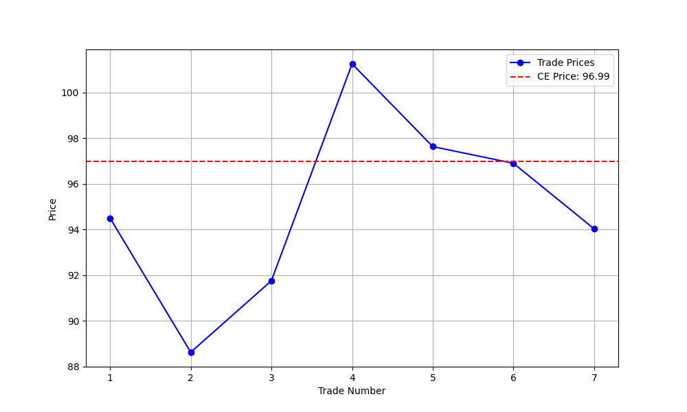
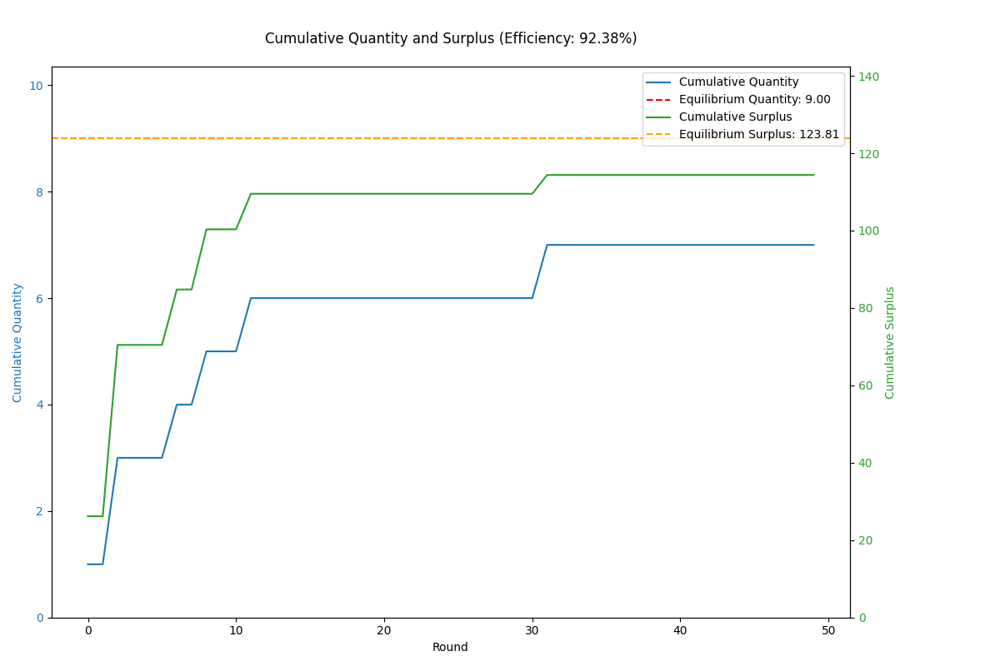

# Auction Report

## Environment Summary
- **Number of Buyers**: 5
- **Number of Sellers**: 5
- **Total Rounds**: 50

## Auction Summary
- **Total Successful Trades**: 7
- **Total Surplus Extracted**: 114.38
- **Average Price**: 94.96
- **Competitive Equilibrium Price**: 96.99
- **Competitive Equilibrium Quantity**: 9
- **Theoretical Total Surplus**: 123.81
- **Practical Total Surplus**: 114.38
- **Difference (Practical - Theoretical)**: -9.44
- **Final Efficiency**: 92.38%

## Theoretical Supply and Demand Curves

## Price vs Trade Number

## Cumulative Quantity and Surplus

## Final Allocation of Agents

| Agent ID | Role   | Initial Goods | Initial Cash | Final Goods | Final Cash | Surplus |
|----------|--------|---------------|--------------|-------------|------------|---------|
| 0 | Buyer | 0 | 590.51 | 1 | 498.76 | 13.88 |
| 1 | Buyer | 0 | 561.43 | 2 | 378.78 | 20.46 |
| 2 | Buyer | 0 | 568.83 | 2 | 376.70 | 25.51 |
| 3 | Buyer | 0 | 537.75 | 0 | 537.75 | 0.00 |
| 4 | Buyer | 0 | 587.22 | 2 | 389.07 | 9.08 |
| 5 | Seller | 5 | 0.00 | 3 | 193.01 | 17.60 |
| 6 | Seller | 5 | 0.00 | 3 | 190.93 | 6.08 |
| 7 | Seller | 5 | 0.00 | 5 | 0.00 | 0.00 |
| 8 | Seller | 5 | 0.00 | 4 | 88.62 | 5.55 |
| 9 | Seller | 5 | 0.00 | 3 | 192.13 | 16.21 |