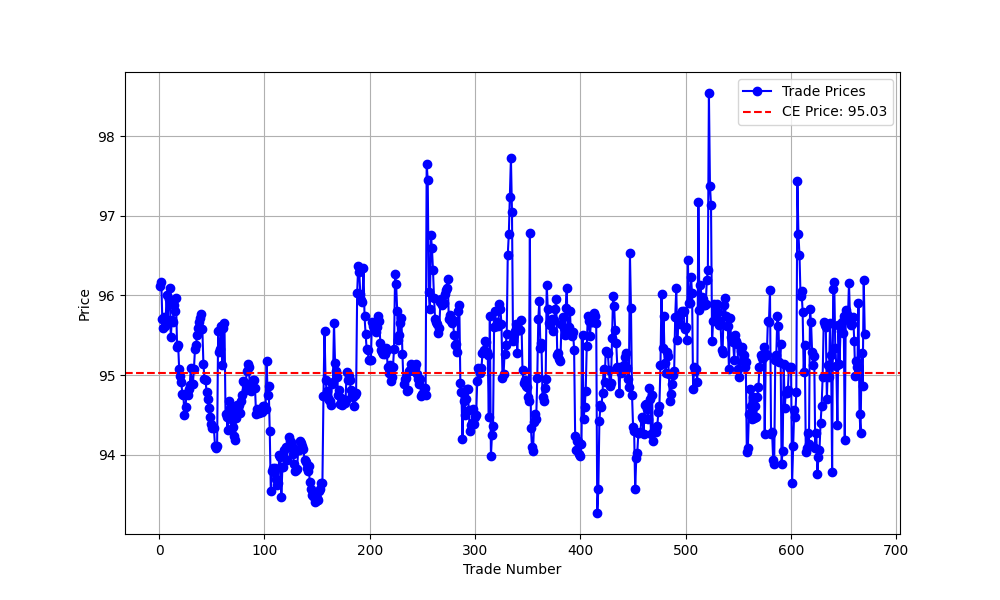
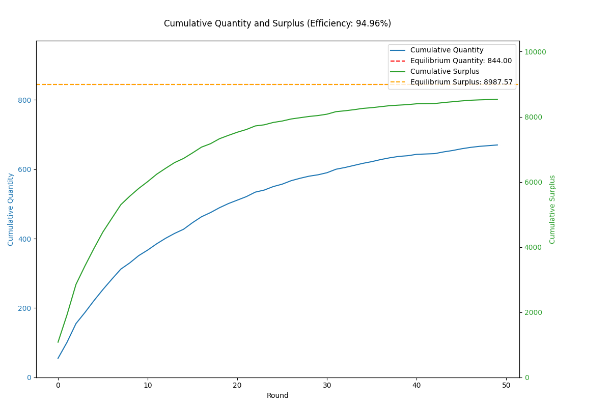

# Auction Report

## Environment Summary
- **Number of Buyers**: 500
- **Number of Sellers**: 500
- **Total Rounds**: 50

## Auction Summary
- **Total Successful Trades**: 670
- **Total Surplus Extracted**: 8534.77
- **Average Price**: 95.09
- **Competitive Equilibrium Price**: 95.03
- **Competitive Equilibrium Quantity**: 844
- **Theoretical Total Surplus**: 8987.57
- **Practical Total Surplus**: 8534.77
- **Difference (Practical - Theoretical)**: -452.80
- **Final Efficiency**: 94.96%

## Theoretical Supply and Demand Curves

## Price vs Trade Number

## Cumulative Quantity and Surplus

## Final Allocation of Agents

| Agent ID | Role   | Initial Goods | Initial Cash | Final Goods | Final Cash | Surplus |
|----------|--------|---------------|--------------|-------------|------------|---------|
| 0 | Buyer | 0 | 558.93 | 2 | 369.10 | 7.23 |
| 1 | Buyer | 0 | 570.85 | 3 | 285.65 | 16.94 |
| 2 | Buyer | 0 | 586.46 | 3 | 303.07 | 13.65 |
| 3 | Buyer | 0 | 539.98 | 1 | 445.87 | 2.23 |
| 4 | Buyer | 0 | 569.10 | 2 | 379.14 | 16.74 |
| 5 | Buyer | 0 | 557.14 | 1 | 461.10 | 9.45 |
| 6 | Buyer | 0 | 536.26 | 0 | 536.26 | 0.00 |
| 7 | Buyer | 0 | 584.08 | 3 | 297.42 | 30.60 |
| 8 | Buyer | 0 | 550.89 | 1 | 456.20 | 15.16 |
| 9 | Buyer | 0 | 544.75 | 2 | 354.78 | 18.58 |
| 10 | Buyer | 0 | 534.17 | 1 | 438.36 | 7.04 |
| 11 | Buyer | 0 | 573.38 | 3 | 287.27 | 13.04 |
| 12 | Buyer | 0 | 554.08 | 1 | 459.57 | 12.10 |
| 13 | Buyer | 0 | 605.64 | 2 | 415.75 | 15.81 |
| 14 | Buyer | 0 | 583.38 | 3 | 299.00 | 19.43 |
| 15 | Buyer | 0 | 548.45 | 0 | 548.45 | 0.00 |
| 16 | Buyer | 0 | 566.61 | 0 | 566.61 | 0.00 |
| 17 | Buyer | 0 | 576.61 | 2 | 386.88 | 16.31 |
| 18 | Buyer | 0 | 540.33 | 0 | 540.33 | 0.00 |
| 19 | Buyer | 0 | 532.63 | 1 | 437.68 | 3.36 |