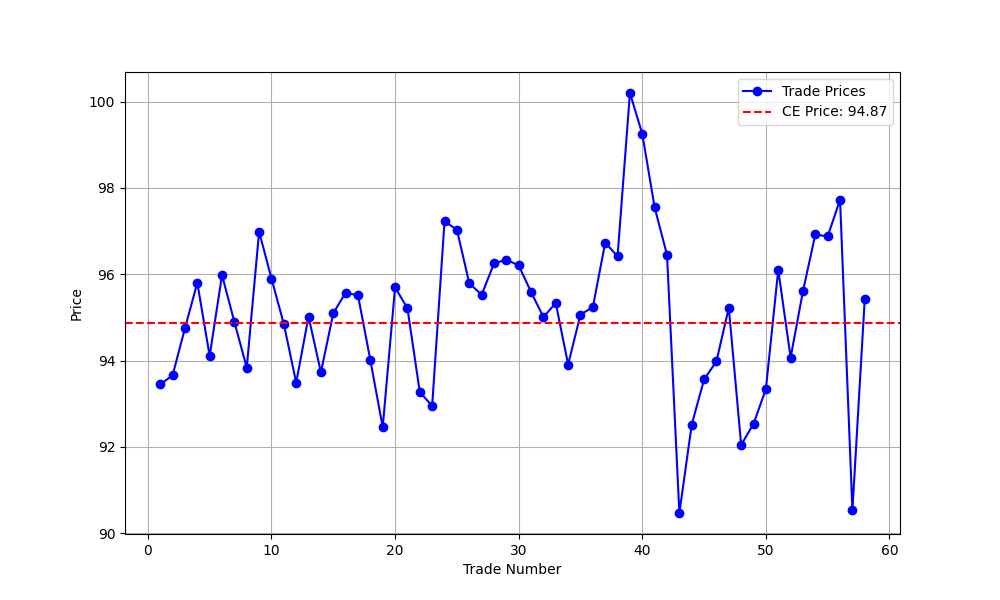

# Auction Report

## Environment Summary
- **Number of Buyers**: 50
- **Number of Sellers**: 50
- **Total Rounds**: 50

## Auction Summary
- **Total Successful Trades**: 58
- **Total Surplus Extracted**: 768.97
- **Average Price**: 95.07
- **Competitive Equilibrium Price**: 94.87
- **Competitive Equilibrium Quantity**: 80
- **Theoretical Total Surplus**: 834.72
- **Practical Total Surplus**: 768.97
- **Difference (Practical - Theoretical)**: -65.75
- **Final Efficiency**: 92.12%

## Theoretical Supply and Demand Curves

## Price vs Trade Number

## Cumulative Quantity and Surplus

## Final Allocation of Agents

| Agent ID | Role   | Initial Goods | Initial Cash | Final Goods | Final Cash | Surplus |
|----------|--------|---------------|--------------|-------------|------------|---------|
| 0 | Buyer | 0 | 587.51 | 2 | 396.67 | 16.12 |
| 1 | Buyer | 0 | 566.85 | 2 | 378.04 | 20.24 |
| 2 | Buyer | 0 | 526.11 | 0 | 526.11 | 0.00 |
| 3 | Buyer | 0 | 543.15 | 2 | 356.89 | 9.80 |
| 4 | Buyer | 0 | 584.33 | 3 | 302.98 | 19.88 |
| 5 | Buyer | 0 | 594.60 | 3 | 309.29 | 32.72 |
| 6 | Buyer | 0 | 537.19 | 0 | 537.19 | 0.00 |
| 7 | Buyer | 0 | 547.12 | 0 | 547.12 | 0.00 |
| 8 | Buyer | 0 | 569.61 | 2 | 381.88 | 18.38 |
| 9 | Buyer | 0 | 534.21 | 0 | 534.21 | 0.00 |
| 10 | Buyer | 0 | 553.01 | 1 | 457.20 | 8.26 |
| 11 | Buyer | 0 | 540.54 | 0 | 540.54 | 0.00 |
| 12 | Buyer | 0 | 589.39 | 3 | 306.07 | 22.92 |
| 13 | Buyer | 0 | 550.18 | 1 | 458.14 | 7.51 |
| 14 | Buyer | 0 | 548.17 | 0 | 548.17 | 0.00 |
| 15 | Buyer | 0 | 533.59 | 0 | 533.59 | 0.00 |
| 16 | Buyer | 0 | 596.26 | 3 | 306.69 | 19.18 |
| 17 | Buyer | 0 | 568.62 | 2 | 372.63 | 14.21 |
| 18 | Buyer | 0 | 544.07 | 2 | 351.56 | 9.78 |
| 19 | Buyer | 0 | 595.16 | 3 | 304.60 | 23.31 |