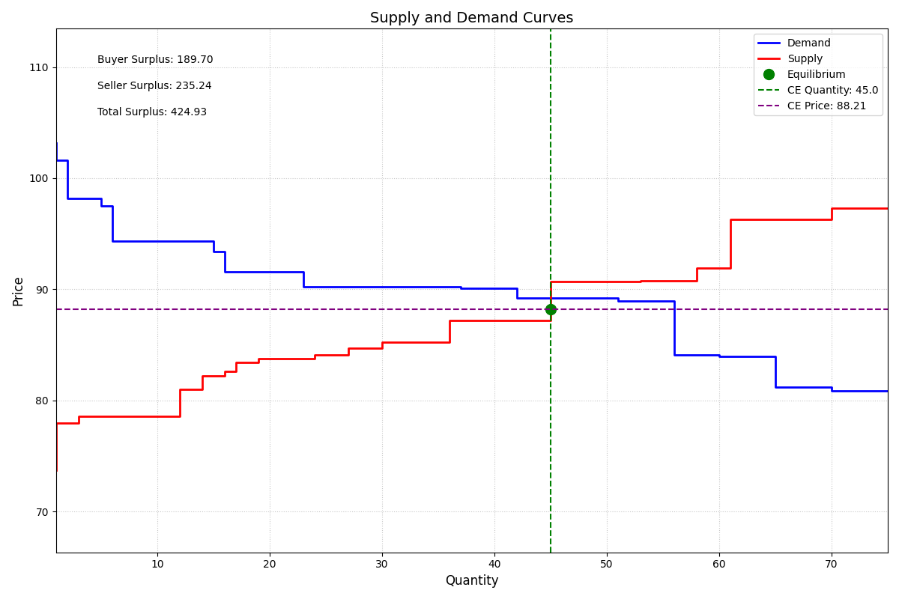
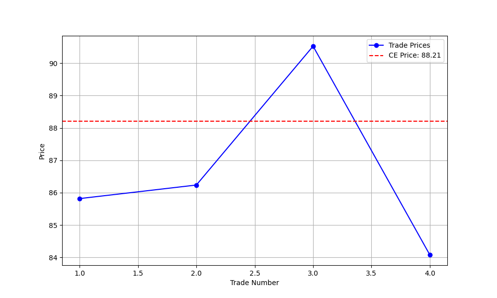
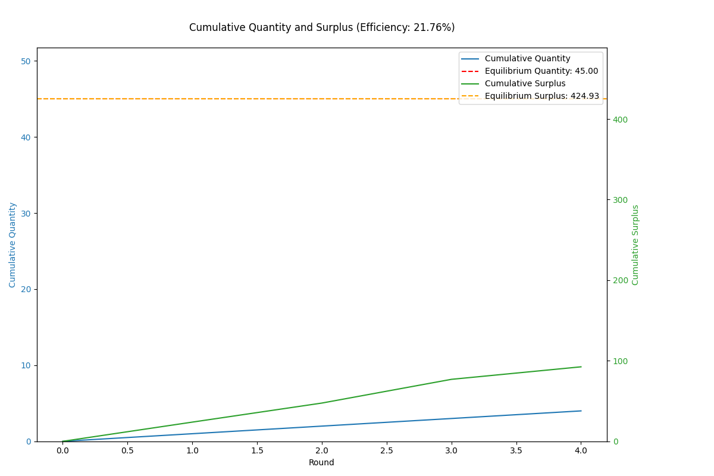

# Auction Report

## Environment Summary
- **Number of Buyers**: 5
- **Number of Sellers**: 5
- **Total Rounds**: 5

## Auction Summary
- **Total Successful Trades**: 4
- **Total Surplus Extracted**: 92.47
- **Average Price**: 86.67
- **Competitive Equilibrium Price**: 88.21
- **Competitive Equilibrium Quantity**: 45.0
- **Theoretical Total Surplus**: 424.93
- **Practical Total Surplus**: 92.47
- **Difference (Practical - Theoretical)**: -332.46
- **Final Efficiency**: 21.76%

## Theoretical Supply and Demand Curves

## Price vs Trade Number

## Cumulative Quantity and Surplus

## Final Allocation of Agents

| Agent ID | Role   | Initial Goods | Initial Cash | Final Goods | Final Cash | Surplus |
|----------|--------|---------------|--------------|-------------|------------|---------|
| 0 | Buyer | 0 | 1000.00 | 1 | 914.18 | 11.72 |
| 1 | Buyer | 0 | 1000.00 | 1 | 915.92 | 14.08 |
| 2 | Buyer | 0 | 1000.00 | 0 | 1000.00 | 0.00 |
| 3 | Buyer | 0 | 1000.00 | 1 | 909.47 | 12.62 |
| 4 | Buyer | 0 | 1000.00 | 1 | 913.76 | 15.39 |
| 5 | Seller | 5 | 0.00 | 5 | 0.00 | 0.00 |
| 6 | Seller | 5 | 0.00 | 3 | 176.34 | 21.64 |
| 7 | Seller | 5 | 0.00 | 4 | 84.08 | 1.45 |
| 8 | Seller | 5 | 0.00 | 4 | 86.24 | 8.26 |
| 9 | Seller | 5 | 0.00 | 5 | 0.00 | 0.00 |